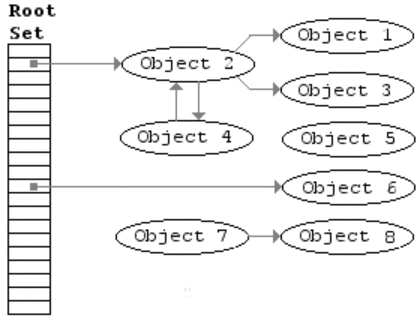
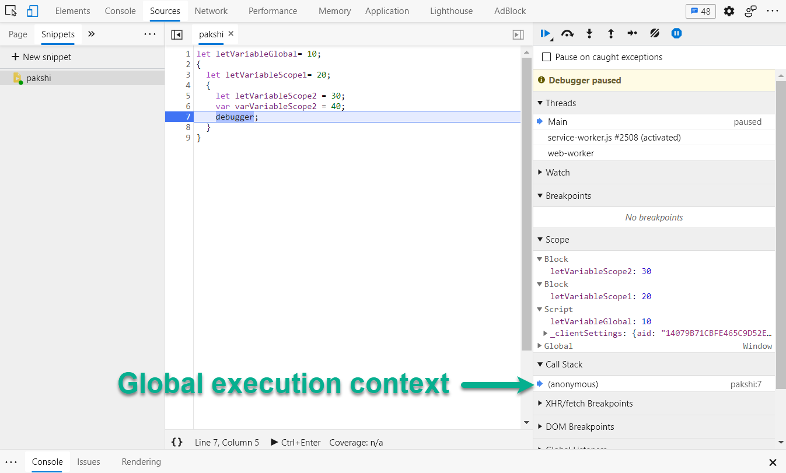
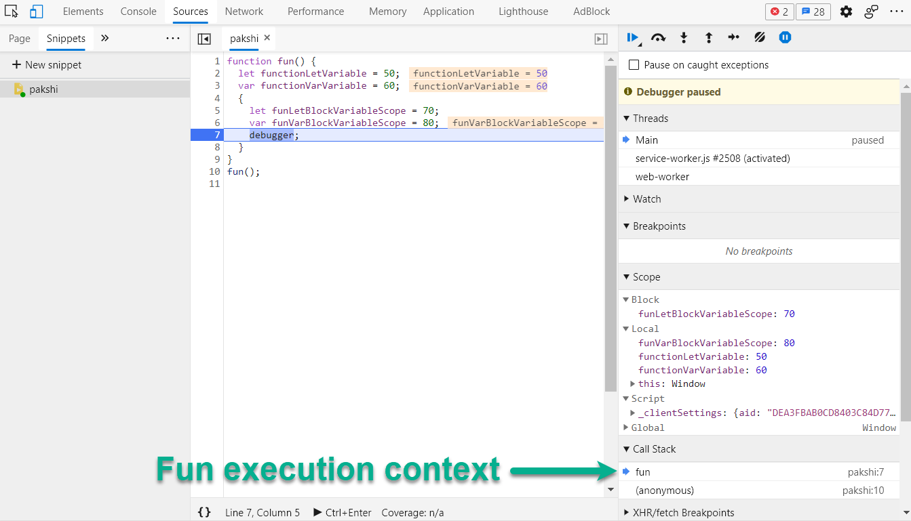
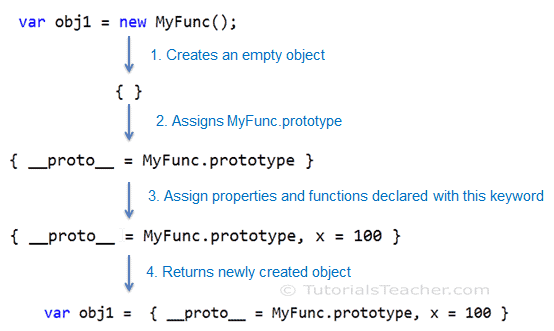
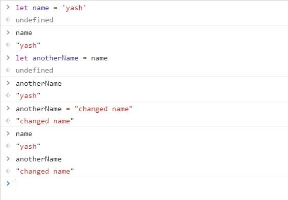
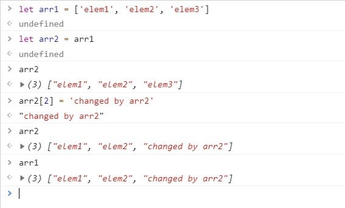
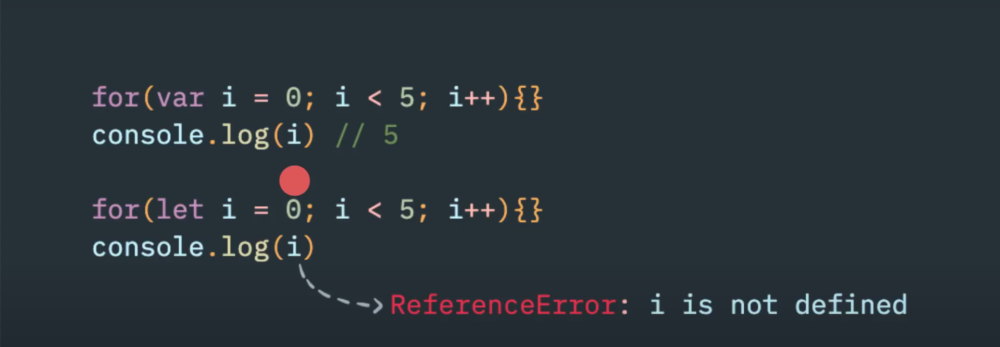
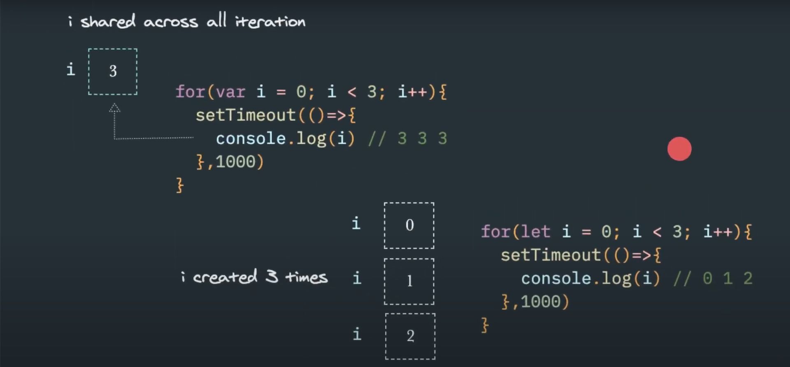
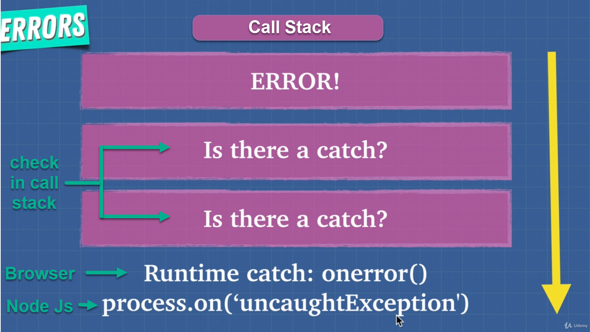

# JavaScript: The Advanced Concepts Study Notes (Live)

## Table of Contents

-   [**JavaScript: The Advanced Concepts Study Notes**](#javascript-the-advanced-concepts-study-notes)

    -   [**Table of Contents**](#table-of-contents)

    -   [**Section 0: Clean Code Javascript**](#clean-code-javascript)
        <details>
        <summary>Click to expand!</summary>

        -   [Introduction](#introduction)
        -   [Variables](#variables)
        -   [Functions](#functions)
        -   [Objects and Data Structures](#objects-and-data-structures)
        -   [Classes](#classes)
        -   [SOLID](#solid)
        -   [Testing](#testing)
        -   [Concurrency](#concurrency)
        -   [Error Handling](#error-handling)
        -   [Formatting](#formatting)
        -   [Comments](#comments)
        -   [Translation](#translation)
        </details>

    -   [**Section 1: Lists and examples for new Javascript features**](#section-1-lists-and-examples-for-new-Javascript-features)
        <details>
          <summary>Click to expand!</summary>

        -   [ES2015 ES6 feature list and examples](#es2015-es6-feature-list-and-examples)
        -   [ES2016 ES7 feature list and examples](#es2016-es7-feature-list-and-examples)
        -   [ES2017 ES8 feature list and examples](#es2017-es8-feature-list-and-examples)
        -   [ES2018 ES9 feature list and examples](#es2018-es9-feature-list-and-examples)
        -   [ES2019 ES10 feature list and examples](#es2019-es10-feature-list-and-examples)
        </details>

    -   [**Section 2: JavaScript Foundation**](#section-2-javascript-foundation)
        <details>
        <summary>Click to expand!</summary>
          
        - [Fastest Way To Load JavaScript](#fastest-way-to-load-javaScript)
        - [Javascript Engine](#javascript-engine)
        - [Inside the Engine](#inside-the-engine)
        - [Interpreters and Compilers](#interpreters-and-compilers)
        - [Babel + TypeScript](#babel--typescript)
        - [Inside the V8 Engine](#inside-the-v8-engine)
        - [Comparing Other Languages](#comparing-other-languages)
        - [Writing Optimized Code](#writing-optimized-code)
        - [WebAssembly](#webassembly)
        - [Call Stack and Memory Heap](#call-stack-and-memory-heap)
        - [Stack Overflow](#stack-overflow)
        - [Garbage Collection](#garbage-collection)
        - [Memory Leaks](#memory-leaks)
        - [Single Threaded](#single-threaded)
        - [Javascript Runtime](#javascript-runtime)
        - [Node.js](#nodejs)
        - [Advanced JavaScript Cheatsheet](#advanced-javascript-cheatsheet)
        </details>

    -   [**Section 3: Javascript Foundation II**](#section-3-javascript-foundation-ii)
        <details>
        <summary>Click to expand!</summary>

        -   [Execution Context](#execution-context)
        -   [Lexical Environment](#lexical-environment)
        -   [Lexical Environment vs Execution Context](#lexical-environment-vs-execution-context)
        -   [Hoisting](#hoisting)
        -   [Function Invocation](#function-invocation)
        -   [arguments Keyword](#arguments-keyword)
        -   [Variable Environment](#variable-environment)
        -   [Block](#block)
        -   [Variable Shadowing](#variable-shadowing)
        -   [Scope Chain](#scope-chain)
        -   [scope](#scope)
        -   [JS is Weird](#js-is-weird)
        -   [Function Scope vs Block Scope](#function-scope-vs-block-scope)
        -   [Global Variables](#global-variables)
        -   [IIFE](#iife)
        -   [this Keyword](#this-keyword)
        -   [new Keyword](#new-keyword)
        -   [Dynamic Scope vs Lexical Scope](#dynamic-scope-vs-lexical-scope)
        -   [call(), apply(), bind()](#call-apply-bind)
        -   [bind() and currying](#bind-and-currying)
        -   [Context vs Scope](#context-vs-scope)
        </details>

    -   [**Section 4: Types in JavaScript**](#section-4-types-in-javascript)
        <details>
        <summary>Click to expand!</summary>

        -   [Javascript Types](#javascript-types)
        -   [Array.isArray()](#arrayisarray)
        -   [Pass By Value vs Pass By Reference](#pass-by-value-vs-pass-by-reference)
        -   [Exercise: Compare Objects](#exercise-compare-objects)
        -   [Exercise: Pass By Reference](#exercise-pass-by-reference)
        -   [Type Coercion](#type-coercion)
        </details>

    -   [**Section 5: The 2 Pillars: Closures and Prototypal Inheritance**](#section-5-the-2-pillars-closures-and-prototypal-inheritance)
        <details>
        <summary>Click to expand!</summary>
          
        - [Functions are callable Objects](#functions-are-callable-objects)
        - [First Class Citizens](#first-class-citizens)
        - [Extra Bits: Functions](#extra-bits-functions)
        - [Higher Order Functions](#higher-order-functions)
        - [Closures](#closures)
        - [Closures and Memory](#closures-and-memory)
        - [Closures and Encapsulation](#closures-and-encapsulation)
        - [Closures Exercises and Solutions](#closures-exercises-and-solutions)
        - [Prototypal Inheritance](#prototypal-inheritance)
        - [Inherit the properties of parent object](#inherit-the-properties-of-parent-object)
        - [Check proprties](#check-proprties)
        - [Create our own prototypes](#create-our-own-prototypes)
        - [Only functions has prototype property](#only-functions-has-prototype-property)
        - [Exercise - extend the functionality of a built in object](#exercise---extend-the-functionality-of-a-built-in-object)
        - [Prototypal Inheritance with this](#prototypal-inheritance-with-this)
        - [Section Review](#section-review)
        </details>

    -   [**Section 6: Object Oriented Programming**](#section-6-object-oriented-programming)
        <details>
        <summary>Click to expand!</summary>
          
        - [Section Overview](#section-overview)
        - [OOP and FP](#oop-and-fp)
        - [OOP Introduction](#oop-introduction)
        - [OOP1: Factory Functions](#oop1-factory-functions)
        - [OOP2: Object.create()](#oop2-objectcreate)
        - [OOP3: Constructor Functions](#oop3-constructor-functions)
        - [OOP4: ES6 Classes](#oop4-es6-classes)
        - [this - 4 Ways](#this---4-ways)
        - [Inheritance](#inheritance)
        - [Public vs Private](#public-vs-private)
        - [4 Pillars of OOP](#4-pillars-of-oop)
        - [Exercise: OOP and Polymorphism](#exercise-oop-and-polymorphism)
        </details>

    -   [**Section 7: Functional Programming**](#section-7-functional-programming)
        <details>
        <summary>Click to expand!</summary>
          
        - [Functional Programming Introduction](#functional-programming-introduction)
        - [Exercise: Amazon shopping](#exercise-amazon-shopping)
        - [Pure Functions](#pure-functions)
        - [Can Everything Be Pure?](#can-everything-be-pure)
        - [Idempotent](#idempotent)
        - [Imperative vs Declarative](#imperative-vs-declarative)
        - [Immutability](#immutability)
        - [Higher Order Functions and Closures](#higher-order-functions-and-closures)
        - [Currying](#currying)
        - [Partial Application](#partial-application)
        - [Compose and Pipe](#compose-and-pipe)
        - [Arity](#arity)
        - [Solution: Amazon](#solution-amazon)
        </details>

    -   [**Section 8: OOP vs FP**](#section-8-oop-vs-fp)
        <details>
        <summary>Click to expand!</summary>
          
        - [Composition vs Inheritance](#composition-vs-inheritance)
        - [OOP vs FP](#oop-vs-fp)
        </details>

    -   [**Section 9: Asynchronous JavaScript**](#section-9-asynchronous-javascript)
        <details>
        <summary>Click to expand!</summary>
          
        - [Job Queue](#job-queue)
        - [Parallel, Sequence and Race](#parallel-sequence-and-race)
        - [Threads, Concurrency and Parallelism](#threads-concurrency-and-parallelism)
        </details>

    -   [**Section 10: Modules In JavaScript**](#section-10-modules-in-javascript)
        <details>
        <summary>Click to expand!</summary>
          
        - [What Is A Module?](#what-is-a-module)
        - [Module Pattern](#module-pattern)
        - [Module Pattern Pros and Cons](#module-pattern-pros-and-cons)
        - [CommonJS, AMD, UMD](#commonjs-amd-umd)
        - [ES6 Modules](#es6-modules)
        </details>

    -   [**Section 11: Error Handling**](#section-11-error-handling)
        <details>
        <summary>Click to expand!</summary>
          
        - [Errors In JavaScript](#errors-in-javascript)
        - [Try Catch](#try-catch)
        - [Async Error Handling](#async-error-handling)
        - [Exercise: Error Handling](#exercise-error-handling)
        - [Extending Errors](#extending-errors)
        </details>

## **Section 0: Clean Code Javascript**

### Introduction


Software engineering principles, from Robert C. Martin's book
[_Clean Code_](https://www.amazon.com/Clean-Code-Handbook-Software-Craftsmanship/dp/0132350882),
adapted for JavaScript. This is not a style guide. It's a guide to producing
[readable, reusable, and refactorable](https://github.com/ryanmcdermott/3rs-of-software-architecture) software in JavaScript.

Not every principle herein has to be strictly followed, and even fewer will be
universally agreed upon. These are guidelines and nothing more, but they are
ones codified over many years of collective experience by the authors of
_Clean Code_.

Our craft of software engineering is just a bit over 50 years old, and we are
still learning a lot. When software architecture is as old as architecture
itself, maybe then we will have harder rules to follow. For now, let these
guidelines serve as a touchstone by which to assess the quality of the
JavaScript code that you and your team produce.

One more thing: knowing these won't immediately make you a better software
developer, and working with them for many years doesn't mean you won't make
mistakes. Every piece of code starts as a first draft, like wet clay getting
shaped into its final form. Finally, we chisel away the imperfections when
we review it with our peers. Don't beat yourself up for first drafts that need
improvement. Beat up the code instead!

### **Variables**

### Use meaningful and pronounceable variable names

**Bad:**

```javascript
const yyyymmdstr = moment().format("YYYY/MM/DD");
```

**Good:**

```javascript
const currentDate = moment().format("YYYY/MM/DD");
```

**[⬆ back to top](#table-of-contents)**

### Use the same vocabulary for the same type of variable

**Bad:**

```javascript
getUserInfo();
getClientData();
getCustomerRecord();
```

**Good:**

```javascript
getUser();
```

**[⬆ back to top](#table-of-contents)**

### Use searchable names

We will read more code than we will ever write. It's important that the code we
do write is readable and searchable. By _not_ naming variables that end up
being meaningful for understanding our program, we hurt our readers.
Make your names searchable. Tools like
[buddy.js](https://github.com/danielstjules/buddy.js) and
[ESLint](https://github.com/eslint/eslint/blob/660e0918933e6e7fede26bc675a0763a6b357c94/docs/rules/no-magic-numbers.md)
can help identify unnamed constants.

**Bad:**

```javascript
// What the heck is 86400000 for?
setTimeout(blastOff, 86400000);
```

**Good:**

```javascript
// Declare them as capitalized named constants.
const MILLISECONDS_IN_A_DAY = 86400000;

setTimeout(blastOff, MILLISECONDS_IN_A_DAY);
```

**[⬆ back to top](#table-of-contents)**

### Use explanatory variables

**Bad:**

```javascript
const address = "One Infinite Loop, Cupertino 95014";
const cityZipCodeRegex = /^[^,\\]+[,\\\s]+(.+?)\s*(\d{5})?$/;
saveCityZipCode(
    address.match(cityZipCodeRegex)[1],
    address.match(cityZipCodeRegex)[2]
);
```

**Good:**

```javascript
const address = "One Infinite Loop, Cupertino 95014";
const cityZipCodeRegex = /^[^,\\]+[,\\\s]+(.+?)\s*(\d{5})?$/;
const [, city, zipCode] = address.match(cityZipCodeRegex) || [];
saveCityZipCode(city, zipCode);
```

**[⬆ back to top](#table-of-contents)**

### Avoid Mental Mapping

Explicit is better than implicit.

**Bad:**

```javascript
const locations = ["Austin", "New York", "San Francisco"];
locations.forEach((l) => {
    doStuff();
    doSomeOtherStuff();
    // ...
    // ...
    // ...
    // Wait, what is `l` for again?
    dispatch(l);
});
```

**Good:**

```javascript
const locations = ["Austin", "New York", "San Francisco"];
locations.forEach((location) => {
    doStuff();
    doSomeOtherStuff();
    // ...
    // ...
    // ...
    dispatch(location);
});
```

**[⬆ back to top](#table-of-contents)**

### Don't add unneeded context

If your class/object name tells you something, don't repeat that in your
variable name.

**Bad:**

```javascript
const Car = {
    carMake: "Honda",
    carModel: "Accord",
    carColor: "Blue",
};

function paintCar(car) {
    car.carColor = "Red";
}
```

**Good:**

```javascript
const Car = {
    make: "Honda",
    model: "Accord",
    color: "Blue",
};

function paintCar(car) {
    car.color = "Red";
}
```

**[⬆ back to top](#table-of-contents)**

### Use default arguments instead of short circuiting or conditionals

Default arguments are often cleaner than short circuiting. Be aware that if you
use them, your function will only provide default values for `undefined`
arguments. Other "falsy" values such as `''`, `""`, `false`, `null`, `0`, and
`NaN`, will not be replaced by a default value.

**Bad:**

```javascript
function createMicrobrewery(name) {
    const breweryName = name || "Hipster Brew Co.";
    // ...
}
```

**Good:**

```javascript
function createMicrobrewery(name = "Hipster Brew Co.") {
    // ...
}
```

**[⬆ back to top](#table-of-contents)**

### **Functions**

### Function arguments (2 or fewer ideally)

Limiting the amount of function parameters is incredibly important because it
makes testing your function easier. Having more than three leads to a
combinatorial explosion where you have to test tons of different cases with
each separate argument.

One or two arguments is the ideal case, and three should be avoided if possible.
Anything more than that should be consolidated. Usually, if you have
more than two arguments then your function is trying to do too much. In cases
where it's not, most of the time a higher-level object will suffice as an
argument.

Since JavaScript allows you to make objects on the fly, without a lot of class
boilerplate, you can use an object if you are finding yourself needing a
lot of arguments.

To make it obvious what properties the function expects, you can use the ES2015/ES6
destructuring syntax. This has a few advantages:

1. When someone looks at the function signature, it's immediately clear what
   properties are being used.
2. Destructuring also clones the specified primitive values of the argument
   object passed into the function. This can help prevent side effects. Note:
   objects and arrays that are destructured from the argument object are NOT
   cloned.
3. Linters can warn you about unused properties, which would be impossible
   without destructuring.

**Bad:**

```javascript
function createMenu(title, body, buttonText, cancellable) {
    // ...
}
```

**Good:**

```javascript
function createMenu({ title, body, buttonText, cancellable }) {
    // ...
}

createMenu({
    title: "Foo",
    body: "Bar",
    buttonText: "Baz",
    cancellable: true,
});
```

**[⬆ back to top](#table-of-contents)**

### Functions should do one thing

This is by far the most important rule in software engineering. When functions
do more than one thing, they are harder to compose, test, and reason about.
When you can isolate a function to just one action, they can be refactored
easily and your code will read much cleaner. If you take nothing else away from
this guide other than this, you'll be ahead of many developers.

**Bad:**

```javascript
function emailClients(clients) {
    clients.forEach((client) => {
        const clientRecord = database.lookup(client);
        if (clientRecord.isActive()) {
            email(client);
        }
    });
}
```

**Good:**

```javascript
function emailActiveClients(clients) {
    clients.filter(isActiveClient).forEach(email);
}

function isActiveClient(client) {
    const clientRecord = database.lookup(client);
    return clientRecord.isActive();
}
```

**[⬆ back to top](#table-of-contents)**

### Function names should say what they do

**Bad:**

```javascript
function addToDate(date, month) {
    // ...
}

const date = new Date();

// It's hard to tell from the function name what is added
addToDate(date, 1);
```

**Good:**

```javascript
function addMonthToDate(month, date) {
    // ...
}

const date = new Date();
addMonthToDate(1, date);
```

**[⬆ back to top](#table-of-contents)**

### Functions should only be one level of abstraction

When you have more than one level of abstraction your function is usually
doing too much. Splitting up functions leads to reusability and easier
testing.

**Bad:**

```javascript
function parseBetterJSAlternative(code) {
    const REGEXES = [
        // ...
    ];

    const statements = code.split(" ");
    const tokens = [];
    REGEXES.forEach((REGEX) => {
        statements.forEach((statement) => {
            // ...
        });
    });

    const ast = [];
    tokens.forEach((token) => {
        // lex...
    });

    ast.forEach((node) => {
        // parse...
    });
}
```

**Good:**

```javascript
function parseBetterJSAlternative(code) {
    const tokens = tokenize(code);
    const ast = lexer(tokens);
    ast.forEach((node) => {
        // parse...
    });
}

function tokenize(code) {
    const REGEXES = [
        // ...
    ];

    const statements = code.split(" ");
    const tokens = [];
    REGEXES.forEach((REGEX) => {
        statements.forEach((statement) => {
            tokens.push(/* ... */);
        });
    });

    return tokens;
}

function lexer(tokens) {
    const ast = [];
    tokens.forEach((token) => {
        ast.push(/* ... */);
    });

    return ast;
}
```

**[⬆ back to top](#table-of-contents)**

### Remove duplicate code

Do your absolute best to avoid duplicate code. Duplicate code is bad because it
means that there's more than one place to alter something if you need to change
some logic.

Imagine if you run a restaurant and you keep track of your inventory: all your
tomatoes, onions, garlic, spices, etc. If you have multiple lists that
you keep this on, then all have to be updated when you serve a dish with
tomatoes in them. If you only have one list, there's only one place to update!

Oftentimes you have duplicate code because you have two or more slightly
different things, that share a lot in common, but their differences force you
to have two or more separate functions that do much of the same things. Removing
duplicate code means creating an abstraction that can handle this set of
different things with just one function/module/class.

Getting the abstraction right is critical, that's why you should follow the
SOLID principles laid out in the _Classes_ section. Bad abstractions can be
worse than duplicate code, so be careful! Having said this, if you can make
a good abstraction, do it! Don't repeat yourself, otherwise you'll find yourself
updating multiple places anytime you want to change one thing.

**Bad:**

```javascript
function showDeveloperList(developers) {
    developers.forEach((developer) => {
        const expectedSalary = developer.calculateExpectedSalary();
        const experience = developer.getExperience();
        const githubLink = developer.getGithubLink();
        const data = {
            expectedSalary,
            experience,
            githubLink,
        };

        render(data);
    });
}

function showManagerList(managers) {
    managers.forEach((manager) => {
        const expectedSalary = manager.calculateExpectedSalary();
        const experience = manager.getExperience();
        const portfolio = manager.getMBAProjects();
        const data = {
            expectedSalary,
            experience,
            portfolio,
        };

        render(data);
    });
}
```

**Good:**

```javascript
function showEmployeeList(employees) {
    employees.forEach((employee) => {
        const expectedSalary = employee.calculateExpectedSalary();
        const experience = employee.getExperience();

        const data = {
            expectedSalary,
            experience,
        };

        switch (employee.type) {
            case "manager":
                data.portfolio = employee.getMBAProjects();
                break;
            case "developer":
                data.githubLink = employee.getGithubLink();
                break;
        }

        render(data);
    });
}
```

**[⬆ back to top](#table-of-contents)**

### Set default objects with Object.assign

**Bad:**

```javascript
const menuConfig = {
    title: null,
    body: "Bar",
    buttonText: null,
    cancellable: true,
};

function createMenu(config) {
    config.title = config.title || "Foo";
    config.body = config.body || "Bar";
    config.buttonText = config.buttonText || "Baz";
    config.cancellable =
        config.cancellable !== undefined ? config.cancellable : true;
}

createMenu(menuConfig);
```

**Good:**

```javascript
const menuConfig = {
    title: "Order",
    // User did not include 'body' key
    buttonText: "Send",
    cancellable: true,
};

function createMenu(config) {
    config = Object.assign(
        {
            title: "Foo",
            body: "Bar",
            buttonText: "Baz",
            cancellable: true,
        },
        config
    );

    // config now equals: {title: "Order", body: "Bar", buttonText: "Send", cancellable: true}
    // ...
}

createMenu(menuConfig);
```

**[⬆ back to top](#table-of-contents)**

### Don't use flags as function parameters

Flags tell your user that this function does more than one thing. Functions should do one thing. Split out your functions if they are following different code paths based on a boolean.

**Bad:**

```javascript
function createFile(name, temp) {
    if (temp) {
        fs.create(`./temp/${name}`);
    } else {
        fs.create(name);
    }
}
```

**Good:**

```javascript
function createFile(name) {
    fs.create(name);
}

function createTempFile(name) {
    createFile(`./temp/${name}`);
}
```

**[⬆ back to top](#table-of-contents)**

### Avoid Side Effects (part 1)

A function produces a side effect if it does anything other than take a value in
and return another value or values. A side effect could be writing to a file,
modifying some global variable, or accidentally wiring all your money to a
stranger.

Now, you do need to have side effects in a program on occasion. Like the previous
example, you might need to write to a file. What you want to do is to
centralize where you are doing this. Don't have several functions and classes
that write to a particular file. Have one service that does it. One and only one.

The main point is to avoid common pitfalls like sharing state between objects
without any structure, using mutable data types that can be written to by anything,
and not centralizing where your side effects occur. If you can do this, you will
be happier than the vast majority of other programmers.

**Bad:**

```javascript
// Global variable referenced by following function.
// If we had another function that used this name, now it'd be an array and it could break it.
let name = "Ryan McDermott";

function splitIntoFirstAndLastName() {
    name = name.split(" ");
}

splitIntoFirstAndLastName();

console.log(name); // ['Ryan', 'McDermott'];
```

**Good:**

```javascript
function splitIntoFirstAndLastName(name) {
    return name.split(" ");
}

const name = "Ryan McDermott";
const newName = splitIntoFirstAndLastName(name);

console.log(name); // 'Ryan McDermott';
console.log(newName); // ['Ryan', 'McDermott'];
```

**[⬆ back to top](#table-of-contents)**

### Avoid Side Effects (part 2)

In JavaScript, primitives are passed by value and objects/arrays are passed by
reference. In the case of objects and arrays, if your function makes a change
in a shopping cart array, for example, by adding an item to purchase,
then any other function that uses that `cart` array will be affected by this
addition. That may be great, however it can be bad too. Let's imagine a bad
situation:

The user clicks the "Purchase", button which calls a `purchase` function that
spawns a network request and sends the `cart` array to the server. Because
of a bad network connection, the `purchase` function has to keep retrying the
request. Now, what if in the meantime the user accidentally clicks "Add to Cart"
button on an item they don't actually want before the network request begins?
If that happens and the network request begins, then that purchase function
will send the accidentally added item because it has a reference to a shopping
cart array that the `addItemToCart` function modified by adding an unwanted
item.

A great solution would be for the `addItemToCart` to always clone the `cart`,
edit it, and return the clone. This ensures that no other functions that are
holding onto a reference of the shopping cart will be affected by any changes.

Two caveats to mention to this approach:

1. There might be cases where you actually want to modify the input object,
   but when you adopt this programming practice you will find that those cases
   are pretty rare. Most things can be refactored to have no side effects!

2. Cloning big objects can be very expensive in terms of performance. Luckily,
   this isn't a big issue in practice because there are
   [great libraries](https://facebook.github.io/immutable-js/) that allow
   this kind of programming approach to be fast and not as memory intensive as
   it would be for you to manually clone objects and arrays.

**Bad:**

```javascript
const addItemToCart = (cart, item) => {
    cart.push({ item, date: Date.now() });
};
```

**Good:**

```javascript
const addItemToCart = (cart, item) => {
    return [...cart, { item, date: Date.now() }];
};
```

**[⬆ back to top](#table-of-contents)**

### Don't write to global functions

Polluting globals is a bad practice in JavaScript because you could clash with another
library and the user of your API would be none-the-wiser until they get an
exception in production. Let's think about an example: what if you wanted to
extend JavaScript's native Array method to have a `diff` method that could
show the difference between two arrays? You could write your new function
to the `Array.prototype`, but it could clash with another library that tried
to do the same thing. What if that other library was just using `diff` to find
the difference between the first and last elements of an array? This is why it
would be much better to just use ES2015/ES6 classes and simply extend the `Array` global.

**Bad:**

```javascript
Array.prototype.diff = function diff(comparisonArray) {
    const hash = new Set(comparisonArray);
    return this.filter((elem) => !hash.has(elem));
};
```

**Good:**

```javascript
class SuperArray extends Array {
    diff(comparisonArray) {
        const hash = new Set(comparisonArray);
        return this.filter((elem) => !hash.has(elem));
    }
}
```

**[⬆ back to top](#table-of-contents)**

### Favor functional programming over imperative programming

JavaScript isn't a functional language in the way that Haskell is, but it has
a functional flavor to it. Functional languages can be cleaner and easier to test.
Favor this style of programming when you can.

**Bad:**

```javascript
const programmerOutput = [
    {
        name: "Uncle Bobby",
        linesOfCode: 500,
    },
    {
        name: "Suzie Q",
        linesOfCode: 1500,
    },
    {
        name: "Jimmy Gosling",
        linesOfCode: 150,
    },
    {
        name: "Gracie Hopper",
        linesOfCode: 1000,
    },
];

let totalOutput = 0;

for (let i = 0; i < programmerOutput.length; i++) {
    totalOutput += programmerOutput[i].linesOfCode;
}
```

**Good:**

```javascript
const programmerOutput = [
    {
        name: "Uncle Bobby",
        linesOfCode: 500,
    },
    {
        name: "Suzie Q",
        linesOfCode: 1500,
    },
    {
        name: "Jimmy Gosling",
        linesOfCode: 150,
    },
    {
        name: "Gracie Hopper",
        linesOfCode: 1000,
    },
];

const totalOutput = programmerOutput
    .map((output) => output.linesOfCode)
    .reduce((totalLines, lines) => totalLines + lines);
```

**[⬆ back to top](#table-of-contents)**

### Encapsulate conditionals

**Bad:**

```javascript
if (fsm.state === "fetching" && isEmpty(listNode)) {
    // ...
}
```

**Good:**

```javascript
function shouldShowSpinner(fsm, listNode) {
    return fsm.state === "fetching" && isEmpty(listNode);
}

if (shouldShowSpinner(fsmInstance, listNodeInstance)) {
    // ...
}
```

**[⬆ back to top](#table-of-contents)**

### Avoid negative conditionals

**Bad:**

```javascript
function isDOMNodeNotPresent(node) {
    // ...
}

if (!isDOMNodeNotPresent(node)) {
    // ...
}
```

**Good:**

```javascript
function isDOMNodePresent(node) {
    // ...
}

if (isDOMNodePresent(node)) {
    // ...
}
```

**[⬆ back to top](#table-of-contents)**

### Avoid conditionals

This seems like an impossible task. Upon first hearing this, most people say,
"how am I supposed to do anything without an `if` statement?" The answer is that
you can use polymorphism to achieve the same task in many cases. The second
question is usually, "well that's great but why would I want to do that?" The
answer is a previous clean code concept we learned: a function should only do
one thing. When you have classes and functions that have `if` statements, you
are telling your user that your function does more than one thing. Remember,
just do one thing.

**Bad:**

```javascript
class Airplane {
    // ...
    getCruisingAltitude() {
        switch (this.type) {
            case "777":
                return this.getMaxAltitude() - this.getPassengerCount();
            case "Air Force One":
                return this.getMaxAltitude();
            case "Cessna":
                return this.getMaxAltitude() - this.getFuelExpenditure();
        }
    }
}
```

**Good:**

```javascript
class Airplane {
    // ...
}

class Boeing777 extends Airplane {
    // ...
    getCruisingAltitude() {
        return this.getMaxAltitude() - this.getPassengerCount();
    }
}

class AirForceOne extends Airplane {
    // ...
    getCruisingAltitude() {
        return this.getMaxAltitude();
    }
}

class Cessna extends Airplane {
    // ...
    getCruisingAltitude() {
        return this.getMaxAltitude() - this.getFuelExpenditure();
    }
}
```

**[⬆ back to top](#table-of-contents)**

### Avoid type-checking (part 1)

JavaScript is untyped, which means your functions can take any type of argument.
Sometimes you are bitten by this freedom and it becomes tempting to do
type-checking in your functions. There are many ways to avoid having to do this.
The first thing to consider is consistent APIs.

**Bad:**

```javascript
function travelToTexas(vehicle) {
    if (vehicle instanceof Bicycle) {
        vehicle.pedal(this.currentLocation, new Location("texas"));
    } else if (vehicle instanceof Car) {
        vehicle.drive(this.currentLocation, new Location("texas"));
    }
}
```

**Good:**

```javascript
function travelToTexas(vehicle) {
    vehicle.move(this.currentLocation, new Location("texas"));
}
```

**[⬆ back to top](#table-of-contents)**

### Avoid type-checking (part 2)

If you are working with basic primitive values like strings and integers,
and you can't use polymorphism but you still feel the need to type-check,
you should consider using TypeScript. It is an excellent alternative to normal
JavaScript, as it provides you with static typing on top of standard JavaScript
syntax. The problem with manually type-checking normal JavaScript is that
doing it well requires so much extra verbiage that the faux "type-safety" you get
doesn't make up for the lost readability. Keep your JavaScript clean, write
good tests, and have good code reviews. Otherwise, do all of that but with
TypeScript (which, like I said, is a great alternative!).

**Bad:**

```javascript
function combine(val1, val2) {
    if (
        (typeof val1 === "number" && typeof val2 === "number") ||
        (typeof val1 === "string" && typeof val2 === "string")
    ) {
        return val1 + val2;
    }

    throw new Error("Must be of type String or Number");
}
```

**Good:**

```javascript
function combine(val1, val2) {
    return val1 + val2;
}
```

**[⬆ back to top](#table-of-contents)**

### Don't over-optimize

Modern browsers do a lot of optimization under-the-hood at runtime. A lot of
times, if you are optimizing then you are just wasting your time. [There are good
resources](https://github.com/petkaantonov/bluebird/wiki/Optimization-killers)
for seeing where optimization is lacking. Target those in the meantime, until
they are fixed if they can be.

**Bad:**

```javascript
// On old browsers, each iteration with uncached `list.length` would be costly
// because of `list.length` recomputation. In modern browsers, this is optimized.
for (let i = 0, len = list.length; i < len; i++) {
    // ...
}
```

**Good:**

```javascript
for (let i = 0; i < list.length; i++) {
    // ...
}
```

**[⬆ back to top](#table-of-contents)**

### Remove dead code

Dead code is just as bad as duplicate code. There's no reason to keep it in
your codebase. If it's not being called, get rid of it! It will still be safe
in your version history if you still need it.

**Bad:**

```javascript
function oldRequestModule(url) {
    // ...
}

function newRequestModule(url) {
    // ...
}

const req = newRequestModule;
inventoryTracker("apples", req, "www.inventory-awesome.io");
```

**Good:**

```javascript
function newRequestModule(url) {
    // ...
}

const req = newRequestModule;
inventoryTracker("apples", req, "www.inventory-awesome.io");
```

**[⬆ back to top](#table-of-contents)**

### **Objects and Data Structures**

### Use getters and setters

Using getters and setters to access data on objects could be better than simply
looking for a property on an object. "Why?" you might ask. Well, here's an
unorganized list of reasons why:

-   When you want to do more beyond getting an object property, you don't have
    to look up and change every accessor in your codebase.
-   Makes adding validation simple when doing a `set`.
-   Encapsulates the internal representation.
-   Easy to add logging and error handling when getting and setting.
-   You can lazy load your object's properties, let's say getting it from a
    server.

**Bad:**

```javascript
function makeBankAccount() {
    // ...

    return {
        balance: 0,
        // ...
    };
}

const account = makeBankAccount();
account.balance = 100;
```

**Good:**

```javascript
function makeBankAccount() {
    // this one is private
    let balance = 0;

    // a "getter", made public via the returned object below
    function getBalance() {
        return balance;
    }

    // a "setter", made public via the returned object below
    function setBalance(amount) {
        // ... validate before updating the balance
        balance = amount;
    }

    return {
        // ...
        getBalance,
        setBalance,
    };
}

const account = makeBankAccount();
account.setBalance(100);
```

**[⬆ back to top](#table-of-contents)**

### Make objects have private members

This can be accomplished through closures (for ES5 and below).

**Bad:**

```javascript
const Employee = function (name) {
    this.name = name;
};

Employee.prototype.getName = function getName() {
    return this.name;
};

const employee = new Employee("John Doe");
console.log(`Employee name: ${employee.getName()}`); // Employee name: John Doe
delete employee.name;
console.log(`Employee name: ${employee.getName()}`); // Employee name: undefined
```

**Good:**

```javascript
function makeEmployee(name) {
    return {
        getName() {
            return name;
        },
    };
}

const employee = makeEmployee("John Doe");
console.log(`Employee name: ${employee.getName()}`); // Employee name: John Doe
delete employee.name;
console.log(`Employee name: ${employee.getName()}`); // Employee name: John Doe
```

**[⬆ back to top](#table-of-contents)**

### **Classes**

### Prefer ES2015/ES6 classes over ES5 plain functions

It's very difficult to get readable class inheritance, construction, and method
definitions for classical ES5 classes. If you need inheritance (and be aware
that you might not), then prefer ES2015/ES6 classes. However, prefer small functions over
classes until you find yourself needing larger and more complex objects.

**Bad:**

```javascript
const Animal = function (age) {
    if (!(this instanceof Animal)) {
        throw new Error("Instantiate Animal with `new`");
    }

    this.age = age;
};

Animal.prototype.move = function move() {};

const Mammal = function (age, furColor) {
    if (!(this instanceof Mammal)) {
        throw new Error("Instantiate Mammal with `new`");
    }

    Animal.call(this, age);
    this.furColor = furColor;
};

Mammal.prototype = Object.create(Animal.prototype);
Mammal.prototype.constructor = Mammal;
Mammal.prototype.liveBirth = function liveBirth() {};

const Human = function (age, furColor, languageSpoken) {
    if (!(this instanceof Human)) {
        throw new Error("Instantiate Human with `new`");
    }

    Mammal.call(this, age, furColor);
    this.languageSpoken = languageSpoken;
};

Human.prototype = Object.create(Mammal.prototype);
Human.prototype.constructor = Human;
Human.prototype.speak = function speak() {};
```

**Good:**

```javascript
class Animal {
    constructor(age) {
        this.age = age;
    }

    move() {
        /* ... */
    }
}

class Mammal extends Animal {
    constructor(age, furColor) {
        super(age);
        this.furColor = furColor;
    }

    liveBirth() {
        /* ... */
    }
}

class Human extends Mammal {
    constructor(age, furColor, languageSpoken) {
        super(age, furColor);
        this.languageSpoken = languageSpoken;
    }

    speak() {
        /* ... */
    }
}
```

**[⬆ back to top](#table-of-contents)**

### Use method chaining

This pattern is very useful in JavaScript and you see it in many libraries such
as jQuery and Lodash. It allows your code to be expressive, and less verbose.
For that reason, I say, use method chaining and take a look at how clean your code
will be. In your class functions, simply return `this` at the end of every function,
and you can chain further class methods onto it.

**Bad:**

```javascript
class Car {
    constructor(make, model, color) {
        this.make = make;
        this.model = model;
        this.color = color;
    }

    setMake(make) {
        this.make = make;
    }

    setModel(model) {
        this.model = model;
    }

    setColor(color) {
        this.color = color;
    }

    save() {
        console.log(this.make, this.model, this.color);
    }
}

const car = new Car("Ford", "F-150", "red");
car.setColor("pink");
car.save();
```

**Good:**

```javascript
class Car {
    constructor(make, model, color) {
        this.make = make;
        this.model = model;
        this.color = color;
    }

    setMake(make) {
        this.make = make;
        // NOTE: Returning this for chaining
        return this;
    }

    setModel(model) {
        this.model = model;
        // NOTE: Returning this for chaining
        return this;
    }

    setColor(color) {
        this.color = color;
        // NOTE: Returning this for chaining
        return this;
    }

    save() {
        console.log(this.make, this.model, this.color);
        // NOTE: Returning this for chaining
        return this;
    }
}

const car = new Car("Ford", "F-150", "red").setColor("pink").save();
```

**[⬆ back to top](#table-of-contents)**

### Prefer composition over inheritance

As stated famously in [_Design Patterns_](https://en.wikipedia.org/wiki/Design_Patterns) by the Gang of Four,
you should prefer composition over inheritance where you can. There are lots of
good reasons to use inheritance and lots of good reasons to use composition.
The main point for this maxim is that if your mind instinctively goes for
inheritance, try to think if composition could model your problem better. In some
cases it can.

You might be wondering then, "when should I use inheritance?" It
depends on your problem at hand, but this is a decent list of when inheritance
makes more sense than composition:

1. Your inheritance represents an "is-a" relationship and not a "has-a"
   relationship (Human->Animal vs. User->UserDetails).
2. You can reuse code from the base classes (Humans can move like all animals).
3. You want to make global changes to derived classes by changing a base class.
   (Change the caloric expenditure of all animals when they move).

**Bad:**

```javascript
class Employee {
    constructor(name, email) {
        this.name = name;
        this.email = email;
    }

    // ...
}

// Bad because Employees "have" tax data. EmployeeTaxData is not a type of Employee
class EmployeeTaxData extends Employee {
    constructor(ssn, salary) {
        super();
        this.ssn = ssn;
        this.salary = salary;
    }

    // ...
}
```

**Good:**

```javascript
class EmployeeTaxData {
    constructor(ssn, salary) {
        this.ssn = ssn;
        this.salary = salary;
    }

    // ...
}

class Employee {
    constructor(name, email) {
        this.name = name;
        this.email = email;
    }

    setTaxData(ssn, salary) {
        this.taxData = new EmployeeTaxData(ssn, salary);
    }
    // ...
}
```

**[⬆ back to top](#table-of-contents)**

### **SOLID**

### Single Responsibility Principle (SRP)

As stated in Clean Code, "There should never be more than one reason for a class
to change". It's tempting to jam-pack a class with a lot of functionality, like
when you can only take one suitcase on your flight. The issue with this is
that your class won't be conceptually cohesive and it will give it many reasons
to change. Minimizing the amount of times you need to change a class is important.
It's important because if too much functionality is in one class and you modify
a piece of it, it can be difficult to understand how that will affect other
dependent modules in your codebase.

**Bad:**

```javascript
class UserSettings {
    constructor(user) {
        this.user = user;
    }

    changeSettings(settings) {
        if (this.verifyCredentials()) {
            // ...
        }
    }

    verifyCredentials() {
        // ...
    }
}
```

**Good:**

```javascript
class UserAuth {
    constructor(user) {
        this.user = user;
    }

    verifyCredentials() {
        // ...
    }
}

class UserSettings {
    constructor(user) {
        this.user = user;
        this.auth = new UserAuth(user);
    }

    changeSettings(settings) {
        if (this.auth.verifyCredentials()) {
            // ...
        }
    }
}
```

**[⬆ back to top](#table-of-contents)**

### Open/Closed Principle (OCP)

As stated by Bertrand Meyer, "software entities (classes, modules, functions,
etc.) should be open for extension, but closed for modification." What does that
mean though? This principle basically states that you should allow users to
add new functionalities without changing existing code.

**Bad:**

```javascript
class AjaxAdapter extends Adapter {
    constructor() {
        super();
        this.name = "ajaxAdapter";
    }
}

class NodeAdapter extends Adapter {
    constructor() {
        super();
        this.name = "nodeAdapter";
    }
}

class HttpRequester {
    constructor(adapter) {
        this.adapter = adapter;
    }

    fetch(url) {
        if (this.adapter.name === "ajaxAdapter") {
            return makeAjaxCall(url).then((response) => {
                // transform response and return
            });
        } else if (this.adapter.name === "httpNodeAdapter") {
            return makeHttpCall(url).then((response) => {
                // transform response and return
            });
        }
    }
}

function makeAjaxCall(url) {
    // request and return promise
}

function makeHttpCall(url) {
    // request and return promise
}
```

**Good:**

```javascript
class AjaxAdapter extends Adapter {
    constructor() {
        super();
        this.name = "ajaxAdapter";
    }

    request(url) {
        // request and return promise
    }
}

class NodeAdapter extends Adapter {
    constructor() {
        super();
        this.name = "nodeAdapter";
    }

    request(url) {
        // request and return promise
    }
}

class HttpRequester {
    constructor(adapter) {
        this.adapter = adapter;
    }

    fetch(url) {
        return this.adapter.request(url).then((response) => {
            // transform response and return
        });
    }
}
```

**[⬆ back to top](#table-of-contents)**

### Liskov Substitution Principle (LSP)

This is a scary term for a very simple concept. It's formally defined as "If S
is a subtype of T, then objects of type T may be replaced with objects of type S
(i.e., objects of type S may substitute objects of type T) without altering any
of the desirable properties of that program (correctness, task performed,
etc.)." That's an even scarier definition.

The best explanation for this is if you have a parent class and a child class,
then the base class and child class can be used interchangeably without getting
incorrect results. This might still be confusing, so let's take a look at the
classic Square-Rectangle example. Mathematically, a square is a rectangle, but
if you model it using the "is-a" relationship via inheritance, you quickly
get into trouble.

**Bad:**

```javascript
class Rectangle {
    constructor() {
        this.width = 0;
        this.height = 0;
    }

    setColor(color) {
        // ...
    }

    render(area) {
        // ...
    }

    setWidth(width) {
        this.width = width;
    }

    setHeight(height) {
        this.height = height;
    }

    getArea() {
        return this.width * this.height;
    }
}

class Square extends Rectangle {
    setWidth(width) {
        this.width = width;
        this.height = width;
    }

    setHeight(height) {
        this.width = height;
        this.height = height;
    }
}

function renderLargeRectangles(rectangles) {
    rectangles.forEach((rectangle) => {
        rectangle.setWidth(4);
        rectangle.setHeight(5);
        const area = rectangle.getArea(); // BAD: Returns 25 for Square. Should be 20.
        rectangle.render(area);
    });
}

const rectangles = [new Rectangle(), new Rectangle(), new Square()];
renderLargeRectangles(rectangles);
```

**Good:**

```javascript
class Shape {
    setColor(color) {
        // ...
    }

    render(area) {
        // ...
    }
}

class Rectangle extends Shape {
    constructor(width, height) {
        super();
        this.width = width;
        this.height = height;
    }

    getArea() {
        return this.width * this.height;
    }
}

class Square extends Shape {
    constructor(length) {
        super();
        this.length = length;
    }

    getArea() {
        return this.length * this.length;
    }
}

function renderLargeShapes(shapes) {
    shapes.forEach((shape) => {
        const area = shape.getArea();
        shape.render(area);
    });
}

const shapes = [new Rectangle(4, 5), new Rectangle(4, 5), new Square(5)];
renderLargeShapes(shapes);
```

**[⬆ back to top](#table-of-contents)**

### Interface Segregation Principle (ISP)

JavaScript doesn't have interfaces so this principle doesn't apply as strictly
as others. However, it's important and relevant even with JavaScript's lack of
type system.

ISP states that "Clients should not be forced to depend upon interfaces that
they do not use." Interfaces are implicit contracts in JavaScript because of
duck typing.

A good example to look at that demonstrates this principle in JavaScript is for
classes that require large settings objects. Not requiring clients to setup
huge amounts of options is beneficial, because most of the time they won't need
all of the settings. Making them optional helps prevent having a
"fat interface".

**Bad:**

```javascript
class DOMTraverser {
    constructor(settings) {
        this.settings = settings;
        this.setup();
    }

    setup() {
        this.rootNode = this.settings.rootNode;
        this.animationModule.setup();
    }

    traverse() {
        // ...
    }
}

const $ = new DOMTraverser({
    rootNode: document.getElementsByTagName("body"),
    animationModule() {}, // Most of the time, we won't need to animate when traversing.
    // ...
});
```

**Good:**

```javascript
class DOMTraverser {
    constructor(settings) {
        this.settings = settings;
        this.options = settings.options;
        this.setup();
    }

    setup() {
        this.rootNode = this.settings.rootNode;
        this.setupOptions();
    }

    setupOptions() {
        if (this.options.animationModule) {
            // ...
        }
    }

    traverse() {
        // ...
    }
}

const $ = new DOMTraverser({
    rootNode: document.getElementsByTagName("body"),
    options: {
        animationModule() {},
    },
});
```

**[⬆ back to top](#table-of-contents)**

### Dependency Inversion Principle (DIP)

This principle states two essential things:

1. High-level modules should not depend on low-level modules. Both should
   depend on abstractions.
2. Abstractions should not depend upon details. Details should depend on
   abstractions.

This can be hard to understand at first, but if you've worked with AngularJS,
you've seen an implementation of this principle in the form of Dependency
Injection (DI). While they are not identical concepts, DIP keeps high-level
modules from knowing the details of its low-level modules and setting them up.
It can accomplish this through DI. A huge benefit of this is that it reduces
the coupling between modules. Coupling is a very bad development pattern because
it makes your code hard to refactor.

As stated previously, JavaScript doesn't have interfaces so the abstractions
that are depended upon are implicit contracts. That is to say, the methods
and properties that an object/class exposes to another object/class. In the
example below, the implicit contract is that any Request module for an
`InventoryTracker` will have a `requestItems` method.

**Bad:**

```javascript
class InventoryRequester {
    constructor() {
        this.REQ_METHODS = ["HTTP"];
    }

    requestItem(item) {
        // ...
    }
}

class InventoryTracker {
    constructor(items) {
        this.items = items;

        // BAD: We have created a dependency on a specific request implementation.
        // We should just have requestItems depend on a request method: `request`
        this.requester = new InventoryRequester();
    }

    requestItems() {
        this.items.forEach((item) => {
            this.requester.requestItem(item);
        });
    }
}

const inventoryTracker = new InventoryTracker(["apples", "bananas"]);
inventoryTracker.requestItems();
```

**Good:**

```javascript
class InventoryTracker {
    constructor(items, requester) {
        this.items = items;
        this.requester = requester;
    }

    requestItems() {
        this.items.forEach((item) => {
            this.requester.requestItem(item);
        });
    }
}

class InventoryRequesterV1 {
    constructor() {
        this.REQ_METHODS = ["HTTP"];
    }

    requestItem(item) {
        // ...
    }
}

class InventoryRequesterV2 {
    constructor() {
        this.REQ_METHODS = ["WS"];
    }

    requestItem(item) {
        // ...
    }
}

// By constructing our dependencies externally and injecting them, we can easily
// substitute our request module for a fancy new one that uses WebSockets.
const inventoryTracker = new InventoryTracker(
    ["apples", "bananas"],
    new InventoryRequesterV2()
);
inventoryTracker.requestItems();
```

**[⬆ back to top](#table-of-contents)**

### **Testing**

Testing is more important than shipping. If you have no tests or an
inadequate amount, then every time you ship code you won't be sure that you
didn't break anything. Deciding on what constitutes an adequate amount is up
to your team, but having 100% coverage (all statements and branches) is how
you achieve very high confidence and developer peace of mind. This means that
in addition to having a great testing framework, you also need to use a
[good coverage tool](http://gotwarlost.github.io/istanbul/).

There's no excuse to not write tests. There are [plenty of good JS test frameworks](http://jstherightway.org/#testing-tools), so find one that your team prefers.
When you find one that works for your team, then aim to always write tests
for every new feature/module you introduce. If your preferred method is
Test Driven Development (TDD), that is great, but the main point is to just
make sure you are reaching your coverage goals before launching any feature,
or refactoring an existing one.

### Single concept per test

**Bad:**

```javascript
import assert from "assert";

describe("MakeMomentJSGreatAgain", () => {
    it("handles date boundaries", () => {
        let date;

        date = new MakeMomentJSGreatAgain("1/1/2015");
        date.addDays(30);
        assert.equal("1/31/2015", date);

        date = new MakeMomentJSGreatAgain("2/1/2016");
        date.addDays(28);
        assert.equal("02/29/2016", date);

        date = new MakeMomentJSGreatAgain("2/1/2015");
        date.addDays(28);
        assert.equal("03/01/2015", date);
    });
});
```

**Good:**

```javascript
import assert from "assert";

describe("MakeMomentJSGreatAgain", () => {
    it("handles 30-day months", () => {
        const date = new MakeMomentJSGreatAgain("1/1/2015");
        date.addDays(30);
        assert.equal("1/31/2015", date);
    });

    it("handles leap year", () => {
        const date = new MakeMomentJSGreatAgain("2/1/2016");
        date.addDays(28);
        assert.equal("02/29/2016", date);
    });

    it("handles non-leap year", () => {
        const date = new MakeMomentJSGreatAgain("2/1/2015");
        date.addDays(28);
        assert.equal("03/01/2015", date);
    });
});
```

**[⬆ back to top](#table-of-contents)**

### **Concurrency**

### Use Promises, not callbacks

Callbacks aren't clean, and they cause excessive amounts of nesting. With ES2015/ES6,
Promises are a built-in global type. Use them!

**Bad:**

```javascript
import { get } from "request";
import { writeFile } from "fs";

get(
    "https://en.wikipedia.org/wiki/Robert_Cecil_Martin",
    (requestErr, response) => {
        if (requestErr) {
            console.error(requestErr);
        } else {
            writeFile("article.html", response.body, (writeErr) => {
                if (writeErr) {
                    console.error(writeErr);
                } else {
                    console.log("File written");
                }
            });
        }
    }
);
```

**Good:**

```javascript
import { get } from "request";
import { writeFile } from "fs";

get("https://en.wikipedia.org/wiki/Robert_Cecil_Martin")
    .then((response) => {
        return writeFile("article.html", response);
    })
    .then(() => {
        console.log("File written");
    })
    .catch((err) => {
        console.error(err);
    });
```

**[⬆ back to top](#table-of-contents)**

### Async/Await are even cleaner than Promises

Promises are a very clean alternative to callbacks, but ES2017/ES8 brings async and await
which offer an even cleaner solution. All you need is a function that is prefixed
in an `async` keyword, and then you can write your logic imperatively without
a `then` chain of functions. Use this if you can take advantage of ES2017/ES8 features
today!

**Bad:**

```javascript
import { get } from "request-promise";
import { writeFile } from "fs-promise";

get("https://en.wikipedia.org/wiki/Robert_Cecil_Martin")
    .then((response) => {
        return writeFile("article.html", response);
    })
    .then(() => {
        console.log("File written");
    })
    .catch((err) => {
        console.error(err);
    });
```

**Good:**

```javascript
import { get } from "request-promise";
import { writeFile } from "fs-promise";

async function getCleanCodeArticle() {
    try {
        const response = await get(
            "https://en.wikipedia.org/wiki/Robert_Cecil_Martin"
        );
        await writeFile("article.html", response);
        console.log("File written");
    } catch (err) {
        console.error(err);
    }
}
```

**[⬆ back to top](#table-of-contents)**

### **Error Handling**

Thrown errors are a good thing! They mean the runtime has successfully
identified when something in your program has gone wrong and it's letting
you know by stopping function execution on the current stack, killing the
process (in Node), and notifying you in the console with a stack trace.

### Don't ignore caught errors

Doing nothing with a caught error doesn't give you the ability to ever fix
or react to said error. Logging the error to the console (`console.log`)
isn't much better as often times it can get lost in a sea of things printed
to the console. If you wrap any bit of code in a `try/catch` it means you
think an error may occur there and therefore you should have a plan,
or create a code path, for when it occurs.

**Bad:**

```javascript
try {
    functionThatMightThrow();
} catch (error) {
    console.log(error);
}
```

**Good:**

```javascript
try {
    functionThatMightThrow();
} catch (error) {
    // One option (more noisy than console.log):
    console.error(error);
    // Another option:
    notifyUserOfError(error);
    // Another option:
    reportErrorToService(error);
    // OR do all three!
}
```

### Don't ignore rejected promises

For the same reason you shouldn't ignore caught errors
from `try/catch`.

**Bad:**

```javascript
getdata()
    .then((data) => {
        functionThatMightThrow(data);
    })
    .catch((error) => {
        console.log(error);
    });
```

**Good:**

```javascript
getdata()
    .then((data) => {
        functionThatMightThrow(data);
    })
    .catch((error) => {
        // One option (more noisy than console.log):
        console.error(error);
        // Another option:
        notifyUserOfError(error);
        // Another option:
        reportErrorToService(error);
        // OR do all three!
    });
```

**[⬆ back to top](#table-of-contents)**

### **Formatting**

Formatting is subjective. Like many rules herein, there is no hard and fast
rule that you must follow. The main point is DO NOT ARGUE over formatting.
There are [tons of tools](http://standardjs.com/rules.html) to automate this.
Use one! It's a waste of time and money for engineers to argue over formatting.

For things that don't fall under the purview of automatic formatting
(indentation, tabs vs. spaces, double vs. single quotes, etc.) look here
for some guidance.

### Use consistent capitalization

JavaScript is untyped, so capitalization tells you a lot about your variables,
functions, etc. These rules are subjective, so your team can choose whatever
they want. The point is, no matter what you all choose, just be consistent.

**Bad:**

```javascript
const DAYS_IN_WEEK = 7;
const daysInMonth = 30;

const songs = ["Back In Black", "Stairway to Heaven", "Hey Jude"];
const Artists = ["ACDC", "Led Zeppelin", "The Beatles"];

function eraseDatabase() {}
function restore_database() {}

class animal {}
class Alpaca {}
```

**Good:**

```javascript
const DAYS_IN_WEEK = 7;
const DAYS_IN_MONTH = 30;

const SONGS = ["Back In Black", "Stairway to Heaven", "Hey Jude"];
const ARTISTS = ["ACDC", "Led Zeppelin", "The Beatles"];

function eraseDatabase() {}
function restoreDatabase() {}

class Animal {}
class Alpaca {}
```

**[⬆ back to top](#table-of-contents)**

### Function callers and callees should be close

If a function calls another, keep those functions vertically close in the source
file. Ideally, keep the caller right above the callee. We tend to read code from
top-to-bottom, like a newspaper. Because of this, make your code read that way.

**Bad:**

```javascript
class PerformanceReview {
    constructor(employee) {
        this.employee = employee;
    }

    lookupPeers() {
        return db.lookup(this.employee, "peers");
    }

    lookupManager() {
        return db.lookup(this.employee, "manager");
    }

    getPeerReviews() {
        const peers = this.lookupPeers();
        // ...
    }

    perfReview() {
        this.getPeerReviews();
        this.getManagerReview();
        this.getSelfReview();
    }

    getManagerReview() {
        const manager = this.lookupManager();
    }

    getSelfReview() {
        // ...
    }
}

const review = new PerformanceReview(employee);
review.perfReview();
```

**Good:**

```javascript
class PerformanceReview {
    constructor(employee) {
        this.employee = employee;
    }

    perfReview() {
        this.getPeerReviews();
        this.getManagerReview();
        this.getSelfReview();
    }

    getPeerReviews() {
        const peers = this.lookupPeers();
        // ...
    }

    lookupPeers() {
        return db.lookup(this.employee, "peers");
    }

    getManagerReview() {
        const manager = this.lookupManager();
    }

    lookupManager() {
        return db.lookup(this.employee, "manager");
    }

    getSelfReview() {
        // ...
    }
}

const review = new PerformanceReview(employee);
review.perfReview();
```

**[⬆ back to top](#table-of-contents)**

### **Comments**

### Only comment things that have business logic complexity.

Comments are an apology, not a requirement. Good code _mostly_ documents itself.

**Bad:**

```javascript
function hashIt(data) {
    // The hash
    let hash = 0;

    // Length of string
    const length = data.length;

    // Loop through every character in data
    for (let i = 0; i < length; i++) {
        // Get character code.
        const char = data.charCodeAt(i);
        // Make the hash
        hash = (hash << 5) - hash + char;
        // Convert to 32-bit integer
        hash &= hash;
    }
}
```

**Good:**

```javascript
function hashIt(data) {
    let hash = 0;
    const length = data.length;

    for (let i = 0; i < length; i++) {
        const char = data.charCodeAt(i);
        hash = (hash << 5) - hash + char;

        // Convert to 32-bit integer
        hash &= hash;
    }
}
```

**[⬆ back to top](#table-of-contents)**

### Don't leave commented out code in your codebase

Version control exists for a reason. Leave old code in your history.

**Bad:**

```javascript
doStuff();
// doOtherStuff();
// doSomeMoreStuff();
// doSoMuchStuff();
```

**Good:**

```javascript
doStuff();
```

**[⬆ back to top](#table-of-contents)**

### Don't have journal comments

Remember, use version control! There's no need for dead code, commented code,
and especially journal comments. Use `git log` to get history!

**Bad:**

```javascript
/**
 * 2016-12-20: Removed monads, didn't understand them (RM)
 * 2016-10-01: Improved using special monads (JP)
 * 2016-02-03: Removed type-checking (LI)
 * 2015-03-14: Added combine with type-checking (JR)
 */
function combine(a, b) {
    return a + b;
}
```

**Good:**

```javascript
function combine(a, b) {
    return a + b;
}
```

**[⬆ back to top](#table-of-contents)**

### Avoid positional markers

They usually just add noise. Let the functions and variable names along with the
proper indentation and formatting give the visual structure to your code.

**Bad:**

```javascript
////////////////////////////////////////////////////////////////////////////////
// Scope Model Instantiation
////////////////////////////////////////////////////////////////////////////////
$scope.model = {
    menu: "foo",
    nav: "bar",
};

////////////////////////////////////////////////////////////////////////////////
// Action setup
////////////////////////////////////////////////////////////////////////////////
const actions = function () {
    // ...
};
```

**Good:**

```javascript
$scope.model = {
    menu: "foo",
    nav: "bar",
};

const actions = function () {
    // ...
};
```

**[⬆ back to top](#table-of-contents)**

**[⬆ back to top](#table-of-contents)**

## **Section 1: Lists and examples for new Javascript features**

### **ES2015 ES6 feature list and examples**

<details>
  <summary>Click to expand!</summary>

See the [ES2015 standard](http://www.ecma-international.org/ecma-262/6.0/) for full specification of the ECMAScript 6 language.

E6 includes the following new features:

-   [arrows](#arrows)
-   [classes](#classes)
-   [enhanced object literals](#enhanced-object-literals)
-   [template strings](#template-strings)
-   [destructuring](#destructuring)
-   [default + rest + spread](#default--rest--spread)
-   [let + const](#let--const)
-   [iterators + for..of](#iterators--forof)
-   [generators](#generators)
-   [unicode](#unicode)
-   [modules](#modules)
-   [module loaders](#module-loaders)
-   [map + set + weakmap + weakset](#map--set--weakmap--weakset)
-   [proxies](#proxies)
-   [symbols](#symbols)
-   [subclassable built-ins](#subclassable-built-ins)
-   [promises](#promises)
-   [math + number + string + array + object APIs](#math--number--string--array--object-apis)
-   [binary and octal literals](#binary-and-octal-literals)
-   [reflect api](#reflect-api)
-   [tail calls](#tail-calls)

## ECMAScript 6 Features

### Arrows

Arrows are a function shorthand using the `=>` syntax. They are syntactically similar to the related feature in C#, Java 8 and CoffeeScript. They spport both statement block bodies as well as expression bodies which return the value of the expression. Unlike functions, arrows share the same lxical `this` as their surrounding code.

```JavaScript
// Expression bodies
var odds = evens.map(v => v + 1);
var nums = evens.map((v, i) => v + i);
var pairs = evens.map(v => ({even: v, odd: v + 1}));
// Statement bodies
nums.forEach(v => {
  if (v % 5 === 0)
    fives.push(v);
});
// Lexical this
var bob = {
  _name: "Bob",
  _friends: [],
  printFriends() {
    this._friends.forEach(f =>
      console.log(this._name + " knows " + f));
  }
}
```

More info: [MDN Arrow Functions](https://developer.mozilla.org/en/docs/Web/JavaScript/Reference/Functions/Arrow_functions)

### Classes

ES6 classes are a simple sugar over the prototype-based OO pattern. Having a single convenient declarative form makes class patterns easier touse, and encourages interoperability. Classes support prototype-based inheritance, super calls, instance and static methods and constructors.

```JavaScript
class SkinnedMesh extends THREE.Mesh {
  constructor(geometry, materials) {
    super(geometry, materials);
    this.idMatrix = SkinnedMesh.defaultMatrix();
    this.bones = [];
    this.boneMatrices = [];
    //...
  }
  update(camera) {
    //...
    super.update();
  }
  get boneCount() {
    return this.bones.length;
  }
  set matrixType(matrixType) {
    this.idMatrix = SkinnedMesh[matrixType]();
  }
  static defaultMatrix() {
    return new THREE.Matrix4();
  }
}
```

More info: [MDN Classes](https://developer.mozilla.org/en/docs/Web/JavaScript/Reference/Classes)

### Enhanced Object Literals

Object literals are extended to support setting the prototype at construction, shorthand for `foo: foo` assignments, defining methods, makingsuper calls, and computing property names with expressions. Together, these also bring object literals and class declarations closer together,and let object-based design benefit from some of the same conveniences.

```JavaScript
var obj = {
    // __proto__
    __proto__: theProtoObj,
    // Shorthand for ‘handler: handler’
    handler,
    // Methods
    toString() {
    // Super calls
    return "d " + super.toString();
    },
    // Computed (dynamic) property names
    [ 'prop_' + (() => 42)() ]: 42
};
```

More info: [MDN Grammar and types: Object literals](https://developer.mozilla.org/en-US/docs/Web/JavaScript/GuideGrammar_and_types#Object_literals)

### Template Strings

Template strings provide syntactic sugar for constructing strings. This is similar to string interpolation features in Perl, Python and more.Optionally, a tag can be added to allow the string construction to be customized, avoiding injection attacks or constructing higher level datastructures from string contents.

```JavaScript
// Basic literal string creation
`In JavaScript '\n' is a line-feed.`
// Multiline strings
`In JavaScript this is
not legal.`
// String interpolation
var name = "Bob", time = "today";
`Hello ${name}, how are you ${time}?`
// Construct an HTTP request prefix is used to interpret the replacements and construction
POST`http://foo.org/bar?a=${a}&b=${b}
    Content-Type: application/json
    X-Credentials: ${credentials}
    { "foo": ${foo},
      "bar": ${bar}}`(myOnReadyStateChangeHandler);
```

More info: [MDN Template Strings](https://developer.mozilla.org/en-US/docs/Web/JavaScript/Reference/template_strings)

### Destructuring

Destructuring allows binding using pattern matching, with support for matching arrays and objects. Destructuring is fail-soft, similar tostandard object lookup `foo["bar"]`, producing `undefined` values when not found.

```JavaScript
// list matching
var [a, , b] = [1,2,3];
// object matching
var { op: a, lhs: { op: b }, rhs: c }
      = getASTNode()
// object matching shorthand
// binds `op`, `lhs` and `rhs` in scope
var {op, lhs, rhs} = getASTNode()
// Can be used in parameter position
function g({name: x}) {
  console.log(x);
}
g({name: 5})
// Fail-soft destructuring
var [a] = [];
a === undefined;
// Fail-soft destructuring with defaults
var [a = 1] = [];
a === 1;
```

More info: [MDN Destructuring assignment](https://developer.mozilla.org/en-US/docs/Web/JavaScript/Reference/Operators/Destructuring_assignment)

### Default + Rest + Spread

Callee-evaluated default parameter values. Turn an array into consecutive arguments in a function call. Bind trailing parameters to an array.Rest replaces the need for `arguments` and addresses common cases more directly.

```JavaScript
function f(x, y=12) {
  // y is 12 if not passed (or passed as undefined)
  return x + y;
}
f(3) == 15
```

```JavaScript
function f(x, ...y) {
  // y is an Array
  return x * y.length;
}
f(3, "hello", true) == 6
```

```JavaScript
function f(x, y, z) {
  return x + y + z;
}
// Pass each elem of array as argument
f(...[1,2,3]) == 6
```

More MDN info: [Default parameters](https://developer.mozilla.org/en-US/docs/Web/JavaScript/Reference/Functions/Default_parameters), [Restparameters](https://developer.mozilla.org/en-US/docs/Web/JavaScript/Reference/Functions/rest_parameters), [Spread Operator](https://developermozilla.org/en-US/docs/Web/JavaScript/Reference/Operators/Spread_operator)

### Let + Const

Block-scoped binding constructs. `let` is the new `var`. `const` is single-assignment. Static restrictions prevent use before assignment.

```JavaScript
function f() {
  {
    let x;
    {
      // okay, block scoped name
      const x = "sneaky";
      // error, const
      x = "foo";
    }
    // error, already declared in block
    let x = "inner";
  }
}
```

More MDN info: [let statement](https://developer.mozilla.org/en-US/docs/Web/JavaScript/Reference/Statements/let), [const statement](https:/developer.mozilla.org/en-US/docs/Web/JavaScript/Reference/Statements/const)

### Iterators + For..Of

Iterator objects enable custom iteration like CLR IEnumerable or Java Iterable. Generalize `for..in` to custom iterator-based iteration with `for.of`. Don’t require realizing an array, enabling lazy design patterns like LINQ.

```JavaScript
let fibonacci = {
  [Symbol.iterator]() {
    let pre = 0, cur = 1;
    return {
      next() {
        [pre, cur] = [cur, pre + cur];
        return { done: false, value: cur }
      }
    }
  }
}
for (var n of fibonacci) {
  // truncate the sequence at 1000
  if (n > 1000)
    break;
  console.log(n);
}
```

Iteration is based on these duck-typed interfaces (using [TypeScript](http://typescriptlang.org) type syntax for exposition only):

```TypeScript
interface IteratorResult {
  done: boolean;
  value: any;
}
interface Iterator {
  next(): IteratorResult;
}
interface Iterable {
  [Symbol.iterator](): Iterator
}
```

More info: [MDN for...of](https://developer.mozilla.org/en-US/docs/Web/JavaScript/Reference/Statements/for...of)

### Generators

Generators simplify iterator-authoring using `function*` and `yield`. A function declared as function\* returns a Generator instance. Generatorsare subtypes of iterators which include additional `next` and `throw`. These enable values to flow back into the generator, so `yield` is anexpression form which returns a value (or throws).
Note: Can also be used to enable ‘await’-like async programming, see also ES7 `await` proposal.

```JavaScript
var fibonacci = {
  [Symbol.iterator]: function*() {
    var pre = 0, cur = 1;
    for (;;) {
      var temp = pre;
      pre = cur;
      cur += temp;
      yield cur;
    }
  }
}
for (var n of fibonacci) {
  // truncate the sequence at 1000
  if (n > 1000)
    break;
  console.log(n);
}
```

The generator interface is (using [TypeScript](http://typescriptlang.org) type syntax for exposition only):

```TypeScript
interface Generator extends Iterator {
    next(value?: any): IteratorResult;
    throw(exception: any);
}
```

More info: [MDN Iteration protocols](https://developer.mozilla.org/en-US/docs/Web/JavaScript/Reference/Iteration_protocols)

### Unicode

Non-breaking additions to support full Unicode, including new Unicode literal form in strings and new RegExp `u` mode to handle code points, aswell as new APIs to process strings at the 21bit code points level. These additions support building global apps in JavaScript.

```JavaScript
// same as ES5.1
"𠮷".length == 2
// new RegExp behaviour, opt-in ‘u’
"𠮷".match(/./u)[0].length == 2
// new form
"\u{20BB7}"=="𠮷"=="\uD842\uDFB7"
// new String ops
"𠮷".codePointAt(0) == 0x20BB7
// for-of iterates code points
for(var c of "𠮷") {
  console.log(c);
}
```

More info: [MDN RegExp.prototype.unicode](https://developer.mozilla.org/en-US/docs/Web/JavaScript/Reference/Global_Objects/RegExp/unicode)

### Modules

Language-level support for modules for component definition. Codifies patterns from popular JavaScript module loaders (AMD, CommonJS). Runtimebehaviour defined by a host-defined default loader. Implicitly async model – no code executes until requested modules are available and processed.

```JavaScript
// lib/math.js
export function sum(x, y) {
  return x + y;
}
export var pi = 3.141593;
```

```JavaScript
// app.js
import * as math from "lib/math";
alert("2π = " + math.sum(math.pi, math.pi));
```

```JavaScript
// otherApp.js
import {sum, pi} from "lib/math";
alert("2π = " + sum(pi, pi));
```

Some additional features include `export default` and `export *`:

```JavaScript
// lib/mathplusplus.js
export * from "lib/math";
export var e = 2.71828182846;
export default function(x) {
    return Math.log(x);
}
```

```JavaScript
// app.js
import ln, {pi, e} from "lib/mathplusplus";
alert("2π = " + ln(e)*pi*2);
```

More MDN info: [import statement](https://developer.mozilla.org/en-US/docs/Web/JavaScript/Reference/Statements/import), [export statement](https:/developer.mozilla.org/en-US/docs/Web/JavaScript/Reference/Statements/export)

### Module Loaders

Module loaders support:

-   Dynamic loading
-   State isolation
-   Global namespace isolation
-   Compilation hooks
-   Nested virtualization
    The default module loader can be configured, and new loaders can be constructed to evaluate and load code in isolated or constrained contexts.

```JavaScript
// Dynamic loading – ‘System’ is default loader
System.import('lib/math').then(function(m) {
  alert("2π = " + m.sum(m.pi, m.pi));
});
// Create execution sandboxes – new Loaders
var loader = new Loader({
  global: fixup(window) // replace ‘console.log’
});
loader.eval("console.log('hello world!');");
// Directly manipulate module cache
System.get('jquery');
System.set('jquery', Module({$: $})); // WARNING: not yet finalized
```

### Map + Set + WeakMap + WeakSet

Efficient data structures for common algorithms. WeakMaps provides leak-free object-key’d side tables.

```JavaScript
// Sets
var s = new Set();
s.add("hello").add("goodbye").add("hello");
s.size === 2;
s.has("hello") === true;
// Maps
var m = new Map();
m.set("hello", 42);
m.set(s, 34);
m.get(s) == 34;
// Weak Maps
var wm = new WeakMap();
wm.set(s, { extra: 42 });
wm.size === undefined
// Weak Sets
var ws = new WeakSet();
ws.add({ data: 42 });
// Because the added object has no other references, it will not be held in the set
```

More MDN info: [Map](https://developer.mozilla.org/en-US/docs/Web/JavaScript/Reference/Global_Objects/Map), [Set](https://developer.mozilla.orgen-US/docs/Web/JavaScript/Reference/Global_Objects/Set), [WeakMap](https://developer.mozilla.org/en-US/docs/Web/JavaScript/ReferenceGlobal_Objects/WeakMap), [WeakSet](https://developer.mozilla.org/en-US/docs/Web/JavaScript/Reference/Global_Objects/WeakSet)

### Proxies

Proxies enable creation of objects with the full range of behaviors available to host objects. Can be used for interception, objectvirtualization, logging/profiling, etc.

```JavaScript
// Proxying a normal object
var target = {};
var handler = {
  get: function (receiver, name) {
    return `Hello, ${name}!`;
  }
};
var p = new Proxy(target, handler);
p.world === 'Hello, world!';
```

```JavaScript
// Proxying a function object
var target = function () { return 'I am the target'; };
var handler = {
  apply: function (receiver, ...args) {
    return 'I am the proxy';
  }
};
var p = new Proxy(target, handler);
p() === 'I am the proxy';
```

There are traps available for all of the runtime-level meta-operations:

```JavaScript
var handler =
{
  get:...,
  set:...,
  has:...,
  deleteProperty:...,
  apply:...,
  construct:...,
  getOwnPropertyDescriptor:...,
  defineProperty:...,
  getPrototypeOf:...,
  setPrototypeOf:...,
  enumerate:...,
  ownKeys:...,
  preventExtensions:...,
  isExtensible:...
}
```

More info: [MDN Proxy](https://developer.mozilla.org/en-US/docs/Web/JavaScript/Reference/Global_Objects/Proxy)

### Symbols

Symbols enable access control for object state. Symbols allow properties to be keyed by either `string` (as in ES5) or `symbol`. Symbols are anew primitive type. Optional `description` parameter used in debugging - but is not part of identity. Symbols are unique (like gensym), but notprivate since they are exposed via reflection features like `Object.getOwnPropertySymbols`.

```JavaScript
var MyClass = (function() {
  // module scoped symbol
  var key = Symbol("key");
  function MyClass(privateData) {
    this[key] = privateData;
  }
  MyClass.prototype = {
    doStuff: function() {
      ... this[key] ...
    }
  };
  return MyClass;
})();
var c = new MyClass("hello")
c["key"] === undefined
```

More info: [MDN Symbol](https://developer.mozilla.org/en-US/docs/Web/JavaScript/Reference/Global_Objects/Symbol)

### Subclassable Built-ins

In ES6, built-ins like `Array`, `Date` and DOM `Element`s can be subclassed.
Object construction for a function named `Ctor` now uses two-phases (both virtually dispatched):

-   Call `Ctor[@@create]` to allocate the object, installing any special behavior
-   Invoke constructor on new instance to initialize
    The known `@@create` symbol is available via `Symbol.create`. Built-ins now expose their `@@create` explicitly.

```JavaScript
// Pseudo-code of Array
class Array {
    constructor(...args) { /* ... */ }
    static [Symbol.create]() {
        // Install special [[DefineOwnProperty]]
        // to magically update 'length'
    }
}
// User code of Array subclass
class MyArray extends Array {
    constructor(...args) { super(...args); }
}
// Two-phase 'new':
// 1) Call @@create to allocate object
// 2) Invoke constructor on new instance
var arr = new MyArray();
arr[1] = 12;
arr.length == 2
```

### Math + Number + String + Array + Object APIs

Many new library additions, including core Math libraries, Array conversion helpers, String helpers, and Object.assign for copying.

```JavaScript
Number.EPSILON
Number.isInteger(Infinity) // false
Number.isNaN("NaN") // false
Math.acosh(3) // 1.762747174039086
Math.hypot(3, 4) // 5
Math.imul(Math.pow(2, 32) - 1, Math.pow(2, 32) - 2) // 2
"abcde".includes("cd") // true
"abc".repeat(3) // "abcabcabc"
Array.from(document.querySelectorAll('*')) // Returns a real Array
Array.of(1, 2, 3) // Similar to new Array(...), but without special one-arg behavior
[0, 0, 0].fill(7, 1) // [0,7,7]
[1, 2, 3].find(x => x == 3) // 3
[1, 2, 3].findIndex(x => x == 2) // 1
[1, 2, 3, 4, 5].copyWithin(3, 0) // [1, 2, 3, 1, 2]
["a", "b", "c"].entries() // iterator [0, "a"], [1,"b"], [2,"c"]
["a", "b", "c"].keys() // iterator 0, 1, 2
["a", "b", "c"].values() // iterator "a", "b", "c"
Object.assign(Point, { origin: new Point(0,0) })
```

More MDN info: [Number](https://developer.mozilla.org/en-US/docs/Web/JavaScript/Reference/Global_Objects/Number), [Math](https://developermozilla.org/en-US/docs/Web/JavaScript/Reference/Global_Objects/Math), [Array.from](https://developer.mozilla.org/en-US/docs/Web/JavaScriptReference/Global_Objects/Array/from), [Array.of](https://developer.mozilla.org/en-US/docs/Web/JavaScript/Reference/Global_Objects/Array/of),[Array.prototype.copyWithin](https://developer.mozilla.org/en-US/docs/Web/JavaScript/Reference/Global_Objects/Array/copyWithin), [Object.assign(https://developer.mozilla.org/en-US/docs/Web/JavaScript/Reference/Global_Objects/Object/assign)

### Binary and Octal Literals

Two new numeric literal forms are added for binary (`b`) and octal (`o`).

```JavaScript
0b111110111 === 503 // true
0o767 === 503 // true
```

### Promises

Promises are a library for asynchronous programming. Promises are a first class representation of a value that may be made available in thefuture. Promises are used in many existing JavaScript libraries.

```JavaScript
function timeout(duration = 0) {
    return new Promise((resolve, reject) => {
        setTimeout(resolve, duration);
    })
}
var p = timeout(1000).then(() => {
    return timeout(2000);
}).then(() => {
    throw new Error("hmm");
}).catch(err => {
    return Promise.all([timeout(100), timeout(200)]);
})
```

More info: [MDN Promise](https://developer.mozilla.org/en-US/docs/Web/JavaScript/Reference/Global_Objects/Promise)

### Reflect API

Full reflection API exposing the runtime-level meta-operations on objects. This is effectively the inverse of the Proxy API, and allows makingcalls corresponding to the same meta-operations as the proxy traps. Especially useful for implementing proxies.

```JavaScript
// No sample yet
```

More info: [MDN Reflect](https://developer.mozilla.org/en-US/docs/Web/JavaScript/Reference/Global_Objects/Reflect)

### Tail Calls

Calls in tail-position are guaranteed to not grow the stack unboundedly. Makes recursive algorithms safe in the face of unbounded inputs.

```JavaScript
function factorial(n, acc = 1) {
    if (n <= 1) return acc;
    return factorial(n - 1, n * acc);
}
// Stack overflow in most implementations today,
// but safe on arbitrary inputs in ES6
factorial(100000)
```

</details>

### ES2016 ES7 feature list and examples

<details>
  <summary>Click to expand!</summary>
  
See the [ES2016 standard](http://www.ecma-international.org/ecma-262/7.0/) for full specification of the ECMAScript 2016 language.

ES2016 includes the following new features:

<!-- START doctoc generated TOC please keep comment here to allow auto update -->
<!-- DON'T EDIT THIS SECTION, INSTEAD RE-RUN doctoc TO UPDATE -->

-   [Array.prototype.includes](#arrayprototypeincludes)
-   [Exponentiation Operator](#exponentiation)

<!-- END doctoc generated TOC please keep comment here to allow auto update -->

---

### `Array.prototype.includes`

This one is a bit like `indexOf` and very useful to the language by relying on returning true or false, not `0`.

#### Syntax:

-   `arr.includes(searchEl[, fromIndex])`
-   **@searchElement**: the element to search for
-   **@fromIndex**: pos in array at which to begin searching
-   **returns**: Boolean

#### Examples:

> basic examples

```javascript
[1, 2, 3]
    .includes(-1) // false
    [(1, 2, 3)].includes(1) // true
    [(1, 2, 3)].includes(3, 4) // false
    [(1, 2, 3)].includes(3, 3) // false
    [(1, 2, NaN)].includes(NaN) // true
    [("foo", "bar", "quux")].includes("foo") // true
    [("foo", "bar", "quux")].includes("norf"); // false
```

> if `fromIndex` is greater than or equal to the len of array, false is automatically returned

```javascript
let arr = ["x", "y", "z"];

arr.includes("x", 3); // false
arr.includes("z", 100); // false
```

### `Exponentiation`

A shorthand method to exponetiation has been introduced in JavaScript:

#### Syntax:

-   `operand` \*\* `operand`

> basic examples

```javascript
Math.pow(5, 2);

// ...is now
5 ** 2;
// 5 ** 2 === 5 * 5
```

</details>

### ES2017 ES8 feature list and examples

<details>
  <summary>Click to expand!</summary>

See the [ES2017 standard](http://www.ecma-international.org/ecma-262/8.0/) for full specification of the ECMAScript 2017 language.

ES2017 includes the following new features:

<!-- START doctoc generated TOC please keep comment here to allow auto update -->
<!-- DON'T EDIT THIS SECTION, INSTEAD RE-RUN doctoc TO UPDATE -->

-   [Async functions](#async-function)
-   [Object.entries](#objectentries)
-   [Object.values](#objectvalues)
-   [Object.getOwnPropertyDescriptors](#objectgetownpropertydescriptors)
-   [Trailing commas](#trailing-commas)

<!-- END doctoc generated TOC please keep comment here to allow auto update -->

---

### `async function`

The asynchronous function returns an `AsyncFunction` object and operates asynchronously via the event loop. The syntax is
very similar to synchronous functions

#### Syntax:

-   async function name([param[, param[, ... param]]]) { statements }
-   **@name**: the function name
-   **@param**: param of the function
-   **statements**: body of the function
-   **returns**: Promise

```javascript
const resolveAfter3Seconds = function () {
    console.log("starting 3 second promsise");
    return new Promise((resolve) => {
        setTimeout(function () {
            resolve(3);
            console.log("done in 3 seconds");
        }, 3000);
    });
};

const resolveAfter1Second = function () {
    console.log("starting 1 second promise");
    return new Promise((resolve) => {
        setTimeout(function () {
            resolve(1);
            console.log("done, in 1 second");
        }, 1000);
    });
};

const sequentialStart = async function () {
    console.log("***SEQUENTIAL START***");
    const one = await resolveAfter1Second();
    const three = await resolveAfter3Seconds();

    console.log(one);
    console.log(three);
};

sequentialStart(); // invoke async function
```

### `Object.entries()`

`Object.entries` gives us the ability to get an object's enumerable property pairs by returning an array of any given
object's own enumerable properties. /ie: [key, value] pairs. Note that the order is the same as provided by the `for...in` loop.

#### Syntax:

-   `Object.entries(obj)`
-   **@params**: `obj`
-   **returns**: Array

#### Examples:

> basic example

```javascript
const obj = { self: "that", norf: "quux" };
console.log(Object.entries(obj));

// => [ ['self', 'that'], ['norf', 'quux'] ]
```

> array like object with random key ordering

```javascript
const obj = { 50: "a", 1: "b", 5: "c" };
console.log(Object.entries(obj));

// => [ ['1', 'b'], ['5', 'c'], ['50', 'a'] ]
```

### `Object.values()`

`Object.values` lets us return an array of a given object's own enumerable property values. Note that the order is the
same as provided by the `for...in` loop.

#### Syntax:

-   `Object.values(obj)`
-   **@params**: `obj`
-   **returns**: Array

#### Examples:

> basic example

```javascript
const obj = { a: 100, b: 200 };
console.log(Object.values(obj));

// => [100, 200]
```

> mixed

```javascript
const obj = { foo: "foo", bar: [100, 200], baz: 55 };
console.log(Object.values(obj));

// => ['foo', [100, 200], 55 ]
```

> string

```javascript
const myStr = "Lufthansa";
console.log(Object.values(myStr));

// => ["L", "u", "f", "t", "h", "a", "n", "s", "a"]
```

### `Object.getOwnPropertyDescriptors()`

`Object.getOwnPropertyDescriptors()` returns all own property descriptors of a given object. A property descriptor
is a record with one of the following attributes:

-   value
-   writable
-   get
-   set
-   configurable
-   enumerable

```javascript
let myObj = {
    property1: "foo",
    property2: "bar",
    property3: 42,
    property4: () => console.log("prop4"),
};

Object.getOwnPropertyDescriptors(myObj);

/*
{ property1: {…}, property2: {…}, property3: {…}, property4: {…} }
  property1: {value: "foo", writable: true, enumerable: true, configurable: true}
  property2: {value: "bar", writable: true, enumerable: true, configurable: true}
  property3: {value: 42, writable: true, enumerable: true, configurable: true}
  property4: {value: ƒ, writable: true, enumerable: true, configurable: true}
  __proto__: Object
*/
```

### `Trailing Commas`

Trailing commas in function declarations and calls are now allowed in JavaScript. When splitting the list of arguments
over several lines, this results in better VCS diffs as only one line will be modified when adding
a new parameter (instead of two).

> trailing commas in function declaration and call

```javascript
function foo(bar, baz) {
    console.log(bar, baz);
}
```

> trailing commas in arguments

```javascript
const func = (a, b, c) => {
    // no error occurs
};
```

</details>

### ES2018 ES9 feature list and examples

<details>
  <summary>Click to expand!</summary>
  
See the [ES2018 standard](http://www.ecma-international.org/ecma-262/9.0/) for full specification of the ECMAScript 2018 language.

ES2018 includes the following new feature proposals:

<!-- START doctoc generated TOC please keep comment here to allow auto update -->
<!-- DON'T EDIT THIS SECTION, INSTEAD RE-RUN doctoc TO UPDATE -->

-   [Async iterators](#async-iterators)
-   [Object rest properties](#object-rest-properties)
-   [Object spread properties](#object-spread-properties)
-   [Promise.prototype.finally](#promise-prototype-finally)

## <!-- END doctoc generated TOC please keep comment here to allow auto update -->

# `Async iterators`

> Async iterators are like iterators, but this time, next() returns a promise. This promise resolves with the tuple { value, done }. A promise needs to be returned because, at the time, the iterator returns the values of value and done are unknown.

```js
function asyncIterator() {
    const array = [1, 2];
    return {
        next: function () {
            if (array.length) {
                return Promise.resolve({
                    value: array.shift(),
                    done: false,
                });
            } else {
                return Promise.resolve({
                    done: true,
                });
            }
        },
    };
}

var iterator = asyncIterator();

(async function () {
    await iterator.next().then(console.log); // { value: 1, done: false }
    await iterator.next().then(console.log); // { value: 2, done: false }
    await iterator.next().then(console.log); // { done: true }
})();
```

# `Object rest properties`

> Rest properties for object destructuring assignment.

```js
let { fname, lname, ...rest } = {
    fname: "Hemanth",
    lname: "HM",
    location: "Earth",
    type: "Human",
};
fname; //"Hemanth"
lname; //"HM"
rest; // {location: "Earth", type: "Human"}
```

# `Object spread properties`

> Spread properties for object destructuring assignment.

```js
let info = { fname, lname, ...rest };

info; // { fname: "Hemanth", lname: "HM", location: "Earth", type: "Human" }
```

# `Promise prototype finally`

> Promise API is extended by an optional _finally_ block which is called in any case (after the Promise is resolved or is rejected).

```js
function testFinally() {
    return new Promise((resolve, reject) => resolve());
}

testFinally()
    .then(() => console.debug("resolved"))
    .finally(() => console.debug("finally"));
// resolved
// finally
```

</details>

### ES2019 ES10 feature list and examples

<details>
  <summary>Click to expand!</summary>

See the [ES2019 standard](http://www.ecma-international.org/ecma-262/10.0/) for full specification of the ECMAScript 2019 language.

ES2019 includes the following new feature proposals:

<!-- START doctoc generated TOC please keep comment here to allow auto update -->
<!-- DON'T EDIT THIS SECTION, INSTEAD RE-RUN doctoc TO UPDATE -->

-   [Array.prototype.{flat,flatMap}](#arrayprototypeflatflatmap)
-   [Object.fromEntries](#objectfromentries)
-   [String.prototype.{trimStart,trimEnd}](#stringprototypetrimstarttrimend)
-   [Symbol.prototype.description](#symbolprototypedescription)
-   [Optional catch binding](#optional-catch-binding)
-   Array.prototype.sort() is now required to be stable

<!-- END doctoc generated TOC please keep comment here to allow auto update -->

---

# Array.prototype.{flat,flatMap}

> The flat() method enables you to easily concatenate all sub-array elements of an array. Consider the following example:

```js
let arr = ["a", "b", ["c", "d"]];
let flattened = arr.flat();

console.log(flattened); // => ["a", "b", "c", "d"]

arr = ["a", , , "b", ["c", "d"]];
flattened = arr.flat();

console.log(flattened); // => ["a", "b", "c", "d"]

arr = [10, [20, [30]]];

console.log(arr.flat()); // => [10, 20, [30]]
console.log(arr.flat(1)); // => [10, 20, [30]]
console.log(arr.flat(2)); // => [10, 20, 30]
```

> The flatMap() method combines map() and flat() into one method. It first creates a new array with the return value of a provided function and then concatenates all sub-array elements of the array. An example should make this clearer:

```js
const arr = [4.25, 19.99, 25.5];

console.log(arr.map((value) => [Math.round(value)]));
// => [[4], [20], [26]]

console.log(arr.flatMap((value) => [Math.round(value)]));
// => [4, 20, 26]
```

# Object.fromEntries

> This static method allows you to easily transform a list of key-value pairs into an object:

```js
const myArray = [
    ["one", 1],
    ["two", 2],
    ["three", 3],
];
const obj = Object.fromEntries(myArray);

console.log(obj); // => {one: 1, two: 2, three: 3}
```

# String.prototype.{trimStart,trimEnd}

> The trimStart() and trimEnd() methods are technically the same as trimLeft() and trimRight(). These methods are currently stage 4 proposals and will be added to the specification for consistency with padStart() and padEnd(). Let’s look at some examples:

```js
const str = "   string   ";

// es2019
console.log(str.trimStart()); // => "string   "
console.log(str.trimEnd()); // => "   string"

// the same as
console.log(str.trimLeft()); // => "string   "
console.log(str.trimRight()); // => "   string"
```

> For web compatibility, trimLeft() and trimRight() will remain as aliases for trimStart() and trimEnd().

# Symbol.prototype.description

> When creating a Symbol, you can add a description to it for debugging purposes. Sometimes, it’s useful to be able to directly access the description in your code.

> This ES2019 proposal adds a read-only description property to the Symbol object, which returns a string containing the description of the Symbol. Here are some examples:

```js
let sym = Symbol("foo");
console.log(sym.description); // => foo

sym = Symbol();
console.log(sym.description); // => undefined

// create a global symbol
sym = Symbol.for("bar");
console.log(sym.description); // => bar
```

# Optional catch binding

> This makes a small change to the ECMAScript specification that allows you to omit the catch binding and its surrounding parentheses:

```js
try {
    // use a feature that the browser might not have implemented
} catch {
    // do something that doesn’t care about the value thrown
}
```

</details>

**[⬆ back to top](#table-of-contents)**

## **Section 2: JavaScript Foundation**

### Fastest Way To Load JavaScript


-   [defer vs async in html explaination](https://youtu.be/BMuFBYw91UQ)

**[⬆ back to top](#table-of-contents)**

### Javascript Engine

-   [List of ECMAScript engines](https://en.wikipedia.org/wiki)
-   [V8 JavaScript engine](https://v8.dev/)
-   [Brendan Eich](https://en.wikipedia.org/wiki/Brendan_Eich)
-   [SpiderMonkey](https://developer.mozilla.org/en-US/docs/Mozilla/Projects/SpiderMonkey)
-   [What’s the difference between JavaScript and ECMAScript?](https://www.freecodecamp.org/news/whats-the-difference-between-javascript-and-ecmascript-cba48c73a2b5/)

**[⬆ back to top](#table-of-contents)**

### Inside the Engine


-   [AST Explorer](https://astexplorer.net/)
-   [JavaScript engine fundamentals: Shapes and Inline Caches](https://mathiasbynens.be/notes/shapes-ics)
-   [What happens inside JavaScript Engine ?](https://www.geeksforgeeks.org/what-happens-inside-javascript-engine/)
-   [How JavaScript works](https://blog.sessionstack.com/how-does-javascript-actually-work-part-1-b0bacc073cf)

```javascript
const jsengine = (code) => code.split(/\s+/);
jsengine("var a = 5");
```

**[⬆ back to top](#table-of-contents)**

### Interpreters and Compilers

-   Interpreter directly executes the instructions in the source programming language
-   compiler translates instructions into efficient machine code
    -   take one language and convert into a different one
-   [Compilers and Interpreters](https://medium.com/hackernoon/compilers-and-interpreters-3e354a2e41cf)
-   [A Deeper Inspection Into Compilation And Interpretation](https://medium.com/basecs/a-deeper-inspection-into-compilation-and-interpretation-d98952ebc842)
-   [Inside the Javascript Engine: Compiler and Interpreter](https://medium.com/@allansendagi/inside-the-javascript-engine-compiler-and-interpreter-c8faa638b0d9)

**[⬆ back to top](#table-of-contents)**

### Babel + TypeScript

Javascript compiler

-   [Babel](https://babeljs.io/)
-   [TypeScript](https://www.typescriptlang.org/)

**[⬆ back to top](#table-of-contents)**

### Inside the V8 Engine

JIT compiler = Interpreter + Compiler

-   It all starts with the JavaScript code you write. The JavaScript engine parses the source code and turns it into an Abstract Syntax Tree (AST). Based on that AST, the interpreter can start to do its thing and produce bytecode. Great! At that point the engine is actually running the JavaScript code.
-   To make it run faster, the bytecode can be sent to the optimizing compiler along with profiling data. The optimizing compiler makes certain assumptions based on the profiling data it has, and then produces highly-optimized machine code.
-   If at some point one of the assumptions turns out to be incorrect, the optimizing compiler deoptimizes and goes back to the interpreter.

**[⬆ back to top](#table-of-contents)**

### Comparing Other Languages

-   Executable file: The product of the linking process. They are machine code which can be directly executed by the CPU.
-   [Machine code vs. Byte code vs. Object code vs. Source code vs. Assembly code vs. Executable code](https://medium.com/@rahul77349/machine-code-vs-byte-code-vs-object-code-vs-source-code-vs-assembly-code-812c9780f24c)

**[⬆ back to top](#table-of-contents)**

### Writing Optimized Code

Memoization is a way to cache a return value of a funcBon based on its parameters. This makes the funcBon that takes a long Bme run much faster aoer one execuBon. If the parameter changes, it will sBll have to reevaluate the funcBon.

[Javascript Hidden Classes and Inline Caching in V8](https://richardartoul.github.io/jekyll/update/2015/04/26/hidden-classes.html)
[Optimizing dynamic JavaScript with inline caches](https://github.com/sq/JSIL/wiki/Optimizing-dynamic-JavaScript-with-inline-caches)

Here are a few things you should avoid when writing your code if possible:

-   eval()

    -   Reasons to Avoid Using eval()

        Unless you are doing really high-level JavaScript (see below) the risks usually outweigh the benefits of using eval(). Here’s some of the reasons to avoid using it:

        1. **Malicious code** : invoking eval can crash a computer. For example: if you use eval server-side and a mischievous user decides to use an infinite loop as their username.

        2. **Terribly slow** : the JavaScript language is designed to use the full gamut(The complete range or scope) of JavaScript types (numbers, functions, objects, etc)… Not just strings! Using eval is orders of magnitude slower than normal JavaScript code.

-   arguments
-   for in
-   with
-   delete

There are a few main reasons these should be avoided.

-   Hidden classes
-   Inline caching

```javascript
// Inline caching
const findUser = (user) => `Found ${user.firstName} ${user.lastName}`;

const userData = {
    firstName: "Johnson",
    lastName: "Junior",
};

// Code that executes the same method repeatedly will run faster than code that executes many different methods only once (due to inline caching).
findUser(userData);
```

```javascript
// Hidden classes
function Animal(x, y) {
    //   Always instantiate your object properties in the same order so that hidden classes, and subsequently optimized code, can be shared.
    this.x = x;
    this.y = y;
}

const obj1 = new Animal(1, 2);
const obj2 = new Animal(3, 4);

// Adding properties to an object after instantiation will force a hidden class change and slow down any methods that were optimized for the previous hidden class. Instead, assign all of an object’s properties in its constructor.
obj1.a = 30;
obj1.b = 100;
obj2.b = 30;
obj2.a = 100;
```

**[⬆ back to top](#table-of-contents)**

### WebAssembly

Why not just use machine code from the beginning?

-   Compile code ahead of time or even just compiling the code on the browser was not feasiblea at all because back in the day that was really really slow
-   Impossible all the browsers agree on an executable format to run javascript

In the future

-   [WebAssembly](https://webassembly.org/)
-   Standard binary executable format

**[⬆ back to top](#table-of-contents)**

### Call Stack and Memory Heap

-   Memory Heap: store and write information
-   Call Stack: keep track of where we are in the code

```javascript
// memory heap

const number = 610; // allocate memory for number
const string = "some text"; // allocate memory for a string
const human = {
    // allocate memory for an object and its value
    first: "Chester",
    last: "Heng",
};

const subtractTwo = (num) => num - 2;
const calculate = () => subtractTwo(4 + 5);

// call stack - FILO
// subtractTwo
// calculate
// Global Execution Context
```

**[⬆ back to top](#table-of-contents)**

### Stack Overflow

```javascript
// When a function calls itself,
// it is called RECURSION
function inception() {
    inception();
}

inception();
// returns Uncaught RangeError:
// Maximum call stack size exceeded
```

**[⬆ back to top](#table-of-contents)**

### Garbage Collection

-   [Memory Management](https://developer.mozilla.org/en-US/docs/Web/JavaScript/Memory_Management)
-   [Garbage collection](https://javascript.info/garbage-collection)
-   [Understanding JavaScript Memory Management using Garbage Collection](https://medium.com/front-end-weekly/understanding-javascript-memory-management-using-garbage-collection-35ed4954a67f)



```javascript
var person = {
    first: "Brittney",
    last: "Postma",
};
person = "Brittney Postma";
```

**[⬆ back to top](#table-of-contents)**

### Memory Leaks

-   [Garbage Collection in Redux Applications](https://developers.soundcloud.com/blog/garbage-collection-in-redux-applications)
-   [Global object](https://developer.mozilla.org/en-US/docs/Glossary/Global_object)

```javascript
// infinite loop
let array = [];
for (let i = 5; i > 1; i++) {
    array.push(i - 1);
}

// global variable
var a = 1;
var b = 1;
var c = 1;

var person = {
    first: "Brittney",
    last: "Postma",
};
person = "Brittney Postma";

// event listeners
var element = document.getElementById("button");
element.addEventListener("click", onClick);

// setInterval
setInterval(() => {
    // reference objec
});
```

**[⬆ back to top](#table-of-contents)**

### Single Threaded

-   Only one thing can be executed at a time
-   Javascript only has one call stack
-   Javascript is a synchronous language
    -   Imagine an alert on the page
    -   Block the user from accessing any part of the page until the OK button is clicked

This is where concurrency and the event loop come in.

**[⬆ back to top](#table-of-contents)**

### Javascript Runtime

-   [The Javascript Runtime Environment](https://medium.com/@olinations/the-javascript-runtime-environment-d58fa2e60dd0)
-   [JS Runtime Playground](http://latentflip.com/loupe)
-   [Web APIs](https://developer.mozilla.org/en-US/docs/Web/API)
    -   see window global object for all Web APIs methods
-   All synchronous code will be pushed to Call Stack and execute in sequence
-   Asynchronous Web APIs code will be executed by browser in the background in sequence
-   Browser will store all Callback functions in Callback Queue
-   Event Loop check for empty Call Stack to make sure all synchronous code has completed execution
    -   Push Callback functions in Callback Queue to Call Stack and start execution

**[⬆ back to top](#table-of-contents)**

### Node.js

Summary

-   I/O Intensive
-   Non-blocking I/O

References

-   [Introduction to Node.js / A beginners guide to Node.js and NPM](https://itnext.io/introduction-to-node-js-a-beginners-guide-to-node-js-and-npm-eca9c408f9fe)
-   [How Node.js Works](https://www.youtube.com/watch?v=jOupHNvDIq8)
-   [How Node JS Works?](https://www.youtube.com/watch?v=YSyFSnisip0)
-   [Global Objects](https://nodejs.org/api/globals.html#globals_global_objects)
-   [10 Things I Regret About Node.js](https://www.youtube.com/watch?v=M3BM9TB-8yA)

**[⬆ back to top](#table-of-contents)**

### Advanced JavaScript Cheatsheet

-   [JavaScript Cheat Sheet: The Advanced Concepts](https://zerotomastery.io/courses/advanced-javascript/cheatsheet/)
-   [JavaScript Cheat Sheet: The Advanced Concepts PDF](ztm-javascript-cheatsheet.pdf)

**[⬆ back to top](#table-of-contents)**

## **Section 3: Javascript Foundation II**

### Execution Context

Global Execution Context

Creation Phase

-   Global object created: window
-   Initializes this keyword to global
-   window === this

Executing Phase

-   Variable Environment created - memory space for var variables and functions created
-   Initializes all variables to undefined (also known as hoistng) and places them with any functions into memory

```javascript
this;
window;
this === window;
```

**[⬆ back to top](#table-of-contents)**

### Lexical Environment

-   lexical environment: the scope or environment the engine is currently reading code in
    -   a new lexical environment is created when curly brackets {} are used
-   lexical scope: available data + variables where function was defined
-   dynamic scope: where function is called

```javascript
function one() {
    var isValid = true; // local env
    two(); // new execution context
}

function two() {
    var isValid; // undefined
}

var isValid = false; // global
one();

// two() isValid = undefined
// one() isValid = true
// global() isValid = false
// -------------------------
// call stack
```

**[⬆ back to top](#table-of-contents)**

### Lexical Environment vs Execution Context

The best way to think of an execution context is as a stack frame, while lexical environments are indeed the scopes.

-   Execution contexts contain the current evaluation state of code, a reference to the code (function) itself, and possibly references to the current lexical environments.
    Execution contexts are managed in a stack.

-   Lexical environments contain an environment record in which the variables are stored, and a reference to their parent environment (if any).
    Lexical environments build a tree structure.

With every change of the execution context, the lexical environment changes as well. However the lexical environment may change independently from that as well, for example when entering a block.

**[⬆ back to top](#table-of-contents)**

### Hoisting

-   Hoisting is the process of putting all variable and function declarations into memory during the compile phase
    -   functions are fully hoisted
    -   var variables are hoisted and initialized to undefined
    -   let and const variables are hoisted but not initialized a value

```javascript
var favouriteFood = "grapes";

var foodThoughts = function () {
    console.log("Original favourite food: " + favouriteFood);
    var favouriteFood = "sushi";
    console.log("New favourite food: " + favouriteFood);
};

foodThoughts();
```

```javascript
// Global Execution Context
// Creation Phase
var favouriteFood = undefined;
var foodThoughts = undefined;

// Executing Phase
favouriteFood = "grapes";
foodThoughts = function () {
    console.log("Original favourite food: " + favouriteFood);
    var favouriteFood = "sushi";
    console.log("New favourite food: " + favouriteFood);
};
```

```javascript
foodThoughts();
// Functional Execution Context
// Creation Phase
var favouriteFood = undefined;

// Executing Phase
("Original favourite food: undefined");
favouriteFood = "sushi";
("New favourite food: sushi");
```

Avoid hoisting when possible. It can cause memory leaks and hard to catch bugs in your code. Use let and const as your go to variables.

**[⬆ back to top](#table-of-contents)**

### Function Invocation

```javascript
// Function Expression
var canada = () => console.log("cold");

// Function Declaration
function india() {
    console.log("warm");
}

// Function Invocation / Call / Execution
canada();
india();
```

Functional Execution Context

-   Only when a function is invoked, does a function execution context get created

Creation Phase

-   Argument object created with any arguments
-   Initializes this keyword to point called or to the global object if not specified

Executing Phase

-   Variable Environment created - memory space for variable and functions created
-   Initializes all variables to undefined and places them into memory with any new functions

**[⬆ back to top](#table-of-contents)**

### arguments Keyword

```javascript
function showArgs(arg1, arg2) {
    console.log("arguments: ", arguments);
    console.log(Array.from(arguments));
}
showArgs("hello", "world");

function showArgs2(...args) {
    console.log("arguments: ", args);
    console.log(args[0], args[1]);
}
showArgs2("hello", "world");

function noArgs() {
    console.log("arguments: ", arguments);
}
noArgs();
```

**[⬆ back to top](#table-of-contents)**

### Variable Environment

**Example: 1**



In general, variable decleared with var keyword will get partially hoisted in global scope and can be accessed directly before executing that statement. let and const will get partially hoisted in script scope but cannot be accessed directly without executing that statement and if let and const are present in inner scope then they will get partially hoisted in block scope and cannot be accessed directly without executing that statement.



inside a function, variable decleared with var keyword will get partially hoisted in local scope and can be accessed directly before executing that statement. let and const will also get partially hoisted in local scope but cannot be accessed directly without executing that statement and if let and const are present in inner scope in the function then they will get partially hoisted in block scope and cannot be accessed directly without executing that statement.

**Example: 2**

```javascript
function two() {
    var isValid;
}

function one() {
    var isValid = true;
    two();
}

var isValid = false;
one();

// global execution context creation
// function two() { ... }
// function one() { ... }
// var isValid = undefined;

// global execution context execution
// var isValid = false;

// function one execution context creation
// var isValid = undefined;

// function one execution context execution
// var isValid = true;

// function two execution context creation
// var isValid = undefined;

// function two execution context execution
```

**[⬆ back to top](#table-of-contents)**

### Block

Block is use to combine multiple javascript statements into one group i.e combined statement.
example:

```javascript
{
    //combined statement
    var a = 10;
    var b = 15;
    a + b;
}
```

if we talk about statement. then we can say that

```javascript
{
    if (true); //statement
}
```

It is a valid statement.

**[⬆ back to top](#table-of-contents)**

### Variable Shadowing

Variable shadowing occurs when a variable of an inner scope is defined with the same name as a variable in the outer scope. In the inner scope, both variables’ scope overlap.


var shadowing example

```javascript
var a = 100;
{
    var a = 5;
    let b = 10;
    const c = 15;
    console.log(a); // 5
}
console.log(a); // 100
```

let and const shadowing example:

```javascript
let b = 200;
{
    var a = 5;
    let b = 10;
    const c = 15;
    console.log(b); // 10
}
console.log(b); // 200
```

lets see example of illegal shadowing

```javascript
let a = 100;
{
    var a = 5;

    console.log(a);
}
console.log(a);
// it will show an error
```

we should use var, let and const on the bases that it will not interfare with the boundaries of var,let and const inside inner block.
This rules are same for functions and arrow functions.

```javascript
var a = 100;
function fun() {
    var a = 5;
    let b = 10;
    const c = 15;
    console.log(a); // 5
}
console.log(a); // 100
```

**[⬆ back to top](#table-of-contents)**

### Scope Chain

-   Lexical Environment === [[scope]]
-   outer scope === [[scope]]

```javascript
// Scope defines the accessibility of variables and functions in the code
// Global Scope is the outer most scope
function sayMyName() {
    var a = "a";
    return function findName() {
        var b = "b";
        console.log(a);
        return function printName() {
            var c = "c";
            console.log(a);
            console.log(b);
            return "Andrei Neagoie";
        };
    };
}

sayMyName()()();
```

**[⬆ back to top](#table-of-contents)**

### [[scope]]

```javascript
function a() {}

// window: {
//   a: f a() {
//     [[Scopes]] : [
//       Script { },
//       Global { }
//     ]
//   }
// }
```

**[⬆ back to top](#table-of-contents)**

### JS is Weird

```javascript
// Weird Javascript #1 - it asks global scope for height
// Global scope says: ummm... no but here I just created it for you.
// We call this leakage of global variables.
function weird() {
    height = 50;
}

weird();
```

```javascript
// leakage of global variables is not allowed
"use strict";
function weird() {
    height = 50;
}

weird();
```

```javascript
var heyhey = function doodle() {
    return "heyhey";
};

heyhey();
doodle(); // Error! because it is enclosed in its own scope.
```

**[⬆ back to top](#table-of-contents)**

### Function Scope vs Block Scope

```javascript
// Function Scope
function loop() {
    for (var i = 0; i < 5; i++) {
        console.log(i);
    }
    console.log(i);
}

// Block Scope
function loop2() {
    for (let i = 0; i < 5; i++) {
        console.log(i);
    }
    console.log(i);
}
```

**[⬆ back to top](#table-of-contents)**

### Global Variables

```javascript
// variable collisions
// all global variables are on the global execution context
// they overwrite each other
var z = 1;
var z = 2;
z;
```

**[⬆ back to top](#table-of-contents)**

### IIFE

```javascript
// place all library code inside local scope
// to avoid any namespace collisions
// function expression
// anonymous function
(function() {

})();

// cannot call function declaration immediately
function a(){}()

var script1 = (function() {
  function a() {
    return 5;
  }
  return {
    a: a
  }
})();
script1.a()
```

**[⬆ back to top](#table-of-contents)**

### this Keyword

this is the object that the function is a property of

```javascript
function a() {
    console.log(this); // this refer to window object
}

const b = () => console.log(this); // this refer to window object

a();
b();
```

```javascript
// gives methods access to their object
const obj = {
    name: "Billy",
    sing: function () {
        return "llala " + this.name + "!";
    },
    singAgain: function () {
        return this.sing();
    },
};

obj.singAgain();
```

```javascript
// execute some code for multiple objects
function importantPerson() {
    console.log(this.name);
}

importantPerson(); // this refer to window object

const name = "Sunny";
const obj1 = { name: "Cassy", importantPerson };
const obj2 = { name: "Jacob", importantPerson };

obj1.importantPerson(); // Cassy
obj2.importantPerson(); // Jacob
```

```javascript
var b = {
    name: "jay",
    say() {
        console.log(this);
    },
};

var c = {
    name: "jay",
    say() {
        return function () {
            console.log(this);
        };
    },
};

var d = {
    name: "jay",
    say() {
        return () => console.log(this);
    },
};

b.say(); // this refer to b object
c.say()(); // this refer to window object
d.say()(); // this refer to b object
```

```javascript
const character = {
    name: "Simon",
    getCharacter() {
        return this.name;
    },
};

const giveMeTheCharacterNOW = character.getCharacter.bind(character);
giveMeTheCharacterNOW();
```

**[⬆ back to top](#table-of-contents)**

### new Keyword

-   object can be created with new keyword.

```javascript
function MyFunc() {
    this.x = 100;
}

var obj1 = new MyFunc();
obj1.x;
```

-   MyFunc() is called a constructor function. The new keyword constructs and returns an object (instance) of a constructor function.
-   The new keyword performs following four tasks:
    1. It creates new empty object e.g. obj = { };
    2. It sets new empty object's invisible 'prototype' property to be the constructor function's visible and accessible 'prototype' property. (Every function has visible 'prototype' property whereas every object includes invisible 'prototype' property).
    3. It binds property or function which is declared with this keyword to the new object.
    4. It returns newly created object unless the constructor function returns a non-primitive value (custom JavaScript object). If constructor function does not include return statement then compiler will insert 'return this;' implicitly at the end of the function. If the constructor function returns a primitive value then it will be ignored.

```JavaScript
//Example: new keyword
function MyFunc() {
    var myVar = 1;
    this.x = 100;
}

MyFunc.prototype.y = 200;

var obj1 = new MyFunc();
obj1.x; // 100
obj1.y; // 200
```

Let's understand what happens when you create an object (instance) of MyFunc() using new keyword.

-   First of all, new keyword creates an empty object - { }.

-   Second, it set's invisible 'prototype' property (or attribute) of this empty object to myFunc's prototype property. As you can see in the above example, we have assigned new property 'y' using MyFunc.prototype.y. So, new empty object will also have same prototype property as MyFunc which includes y property.

-   In third step, it binds all the properties and function declared with this keyword to new empty object. Here, MyFunc includes only one property x which is declared with this keyword. So new empty object will now include x property. MyFunc also includes myVar variable which does not declared with this keyword. So myVar will not be included in new object.

-   In the fourth and last step, it will return this newly created object. MyFunc does not include return statement but compiler will implicitly insert 'return this' at the end.

The following figure illustrates the above process.



The new keyword ignores return statement that returns primitive value.

```Javascript
Example: new keyword
function MyFunc() {
    this.x = 100;

    return 200;
}

var obj = new MyFunc();
alert(obj.x); // 100
```

If function returns non-primitive value (custom object) then new keyword does not perform above 4 tasks.

```Javascript
Example: new keyword
function MyFunc() {
    this.x = 100;

    return { a: 123 };
}

var obj1 = new MyFunc();

alert(obj1.x); // undefined
```

Thus, new keyword builds an object of a function in JavaScript.

**[⬆ back to top](#table-of-contents)**

### Dynamic Scope vs Lexical Scope

-   lexical scope: available data + variables where function was defined
-   dynamic scope: where function is called
    -   this keyword is dynamic scope

| Lexical scope                 | Dynamic Scope                    |
| ----------------------------- | -------------------------------- |
| write-time                    | run-time                         |
| where a function was declared | where a function was called from |

```javascript
const a = function () {
    console.log("a", this); // this refer to window object
    const b = function () {
        console.log("b", this); // this refer to window object
        const c = {
            hi: function () {
                console.log("c", this); /// this refer to c object
            },
        };
        c.hi();
    };
    b();
};

a();
```

```javascript
const obj = {
    name: "Billy",
    sing: function () {
        console.log("a", this); // refer to obj object
        const anotherFunc = function () {
            console.log("b", this); // refer to window object
        };
    },
};
obj.sing();
```

```javascript
const obj = {
    name: "Billy",
    sing() {
        console.log("a", this); // refer to obj object
        // arrow function is lexical bound
        const anotherFunc = () => console.log("b", this); // refer to obj object
        anotherFunc();
    },
};
obj.sing();
```

```javascript
const obj = {
    name: "Billy",
    sing() {
        console.log("a", this); // refer to obj object
        const anotherFunc = function () {
            console.log("b", this); // refer to obj object
        };
        return anotherFunc.bind(this);
    },
};
obj.sing()();
```

```javascript
const obj = {
    name: "Billy",
    sing() {
        console.log("a", this); // refer to obj object
        const self = this;
        const anotherFunc = function () {
            console.log("b", self); // refer to obj object
        };
        return anotherFunc;
    },
};
obj.sing()();
```

**[⬆ back to top](#table-of-contents)**

### call(), apply(), bind()

```javascript
function a() {
    console.log("hi");
}
a();
a.call();
a.apply();
```

```javascript
const wizard = {
    name: "Merlin",
    health: 100,
    heal(num1, num2) {
        this.health += num1 + num2;
    },
};

const archer = {
    name: "Robin Hood",
    health: 50,
};

wizard.heal(10, 60);
// borrow heal method from wizard object
wizard.heal.call(archer, 50, 60);
wizard.heal.apply(archer, [20, 30]);

// borrow heal method from wizard object
// call healArcher later on with archer object
const healArcher = wizard.heal.bind(archer, 50, 60);
healArcher();
```

```javascript
const array = [1, 2, 3];

function getMaxNumber(arr) {
    return Math.max.apply(null, arr);
}

const getMaxNumber = (arr) => Math.max.apply(null, arr);

getMaxNumber(array);
```

**[⬆ back to top](#table-of-contents)**

### bind() and currying

-   translates a function from callable as f(a, b, c) into callable as f(a)(b)(c)
-   [Currying](https://javascript.info/currying-partials)
-   [Currying: A Functional Alternative To fn.bind](https://derickbailey.com/2016/06/24/currying-a-functional-alternative-to-fn-bind/)

```javascript
function sum(a, b) {
    return a + b;
}

// curry(f) does the currying transform
function curry(f) {
    return function (a) {
        return function (b) {
            return f(a, b);
        };
    };
}

let curriedSum = curry(sum);

curriedSum(1)(2);
```

```javascript
function multiply(a, b, c) {
    return a * b * c;
}

const multipleByTwo = multiply.bind(this, 2, 4);
console.log(multipleByTwo(4));

const multipleByThree = multiply.bind(this, 3, 5);
console.log(multipleByThree(4));
```

**[⬆ back to top](#table-of-contents)**

### Context vs Scope

-   [Understanding Scope and Context in JavaScript](http://ryanmorr.com/understanding-scope-and-context-in-javascript/)
-   Scope is function based
    -   what is the variable access of a function when it is invoked?
    -   What is in the variable environment?
    -   scope refers to the visibility of variables
-   Context is object based
    -   what is the value of this keyword?
    -   context is most often determined by how a function is invoked with the value of this keyword

**[⬆ back to top](#table-of-contents)**

## **Section 4: Types in JavaScript**

### Javascript Types

**Premitive Types**
In JavaScript, a primitive (primitive value, primitive data type) is data that is not an object and has no methods. There are 7 primitive data types: string, number, bigint, boolean, undefined, symbol, and null.

All primitives are immutable, i.e., they cannot be altered. It is important not to confuse a primitive itself with a variable assigned a primitive value. The variable may be reassigned a new value, but the existing value can not be changed in the ways that objects, arrays, and functions can be altered.

```JavaScript
// Primitive
typeof 5;
typeof true;
typeof "To be or not to be";
typeof undefined; // absent of definition
typeof null; // absent of value
typeof Symbol("just me");
```

Let me make it more clear for you by an example:



Look at an above simple example, There I have defined name variable by assigning String primitive type. In order to demonstrate the above-stated points about primitive types, I have created the second variable with name anotherName and copied the value of the name variable into it. Then, I changed the value of anotherName variable to something else. Then, I have printed both variables.

As you can clearly see, Both values are different that clearly proves that values are copied in the case of Primitive types.

**Reference Types**

-   Now you can probably guess about Reference types. It consists of Array, Object, and Function.
-   In the case of Reference types Variables actually don't have the actual values but it contains a reference to that particular value.
-   Here, Reference simply means a pointer to another memory location that holds particular value. This might be sound confusing for you at first glance but bear with me. Once you go through it would be very clear to you.

```javascript
// Non-Primitive
// has a reference or pointer
typeof {};
typeof [];
typeof function () {};

const obj1 = {
    a: "Tom",
};

// function and array are objects
function a() {
    return 5;
}
a.hi = "hi";

// Object wrapper
true.toString();
Boolean(true).toString();
```

Example:



In the above example, I have used an array to demonstrate the working of Reference types in JavaScript. First, I have defined arr1 with three elements in it. Then, I have defined arr2 by copying arr1 into it. Now, let me reveal the magic by changing one of the elements in arr2. And then, I have printed both arrays and surprise, both are having that updated value though I have not touched the arr1.

This result produced because of the default behavior of Reference types in JavaScript. As I stated above that Reference types are not copying the actual values rather they are just keeping the reference to that particular value in the memory.

You might have a question that Why Reference types created although we could simply just copy the values:
Answer: It is not always optimal to just copy the values when we are assigning value to a variable. Because copying the values would cost large overhead as it needs to allocate a new memory block and copies the values from that location to this newly allocated memory location. It would be easy in the case of Primitive types as it would not contain many values as arrays or objects.

So this behavior is implemented to save time and memory both.

[Standard built-in objects](https://developer.mozilla.org/en-US/docs/Web/JavaScript/Reference/Global_Objects)

**[⬆ back to top](#table-of-contents)**

### Array.isArray()

```javascript
const array = ["1", "2", "3"];
const obj = {
    0: "1",
    1: "2",
    2: "3",
};

Array.isArray(array);
Array.isArray(obj);
```

**[⬆ back to top](#table-of-contents)**

### Pass By Value vs Pass By Reference

```javascript
// pass by value
var a = 5;
var b = a;
b++;

// pass by reference
let obj1 = { name: "Yao", password: "123" };
let obj2 = obj1;
obj2.password = "easy";

var c = [1, 2, 3];
var d = c;
d.push(4);

var c = [1, 2, 3];
var d = [].concat(c); // clone array
d.push(4);
```

**[⬆ back to top](#table-of-contents)**

### Exercise: Compare Objects

[Compare objects with JavaScript](https://bithacker.dev/compare-objects-javascript)

```javascript
var user1 = { name: "nerd", org: "dev", c: { d: "d" } };
var user2 = { name: "nerd", org: "dev", c: { d: "d" } };
JSON.stringify(user1) === JSON.stringify(user2);
```

**[⬆ back to top](#table-of-contents)**

### Exercise: Pass By Reference

```javascript
const number = 100;
const string = "Jay";
let obj1 = {
    value: "a",
};
let obj2 = {
    value: "b",
};
let obj3 = obj2;

function change(number, string, obj1, obj2) {
    number = number * 10;
    string = "Pete";
    obj1 = obj2;
    obj2.value = "c";
}

change(number, string, obj1, obj2);

//Guess the outputs here before you run the code:
// number  100
// string  'Jay'
// obj1    { value: 'a' }
// obj2    { value: 'c' }
// obj3    { value: 'c' }
```

**[⬆ back to top](#table-of-contents)**

### Type Coercion

-   [JS Comparison Table](https://dorey.github.io/JavaScript-Equality-Table/)
-   [Equality comparisons and sameness](https://developer.mozilla.org/en-US/docs/Web/JavaScript/Equality_comparisons_and_sameness)
-   [The Abstract Equality Comparison Algorithm](https://www.ecma-international.org/ecma-262/5.1/#sec-11.9.3)

```javascript
if (1) {
    // true
    console.log(5);
}
if (0) {
    // false
    console.log(5);
}
```

**[⬆ back to top](#table-of-contents)**

## **Section 5: The 2 Pillars: Closures and Prototypal Inheritance**

### Functions are callable Objects

```javascript
// Invoke function
function one() {
    return 1;
}
one();
one.call();
one.apply();

const obj = {
    two: function () {
        return 2;
    },
};
obj.two();

const four = new Function("num", "return num");
four(4);
```

Function

-   code ()
-   name (optional)
-   properties: .call(), .apply(), .bind()
-   pass function around like object

```javascript
function woohooo() {
    console.log("woohooo");
}

woohooo.yell = "ahhhhhhh";
woohooo.name;

// const specialObj = {
//   yell: 'ahhhhhhh',
//   name: 'woohooo',
//   (): console.log('woohooo')
// }
```

**[⬆ back to top](#table-of-contents)**

### First Class Citizens

Functions are first class citizens in JavaScript

-   Function can be assigned to a variable
-   Function can be passed as a paramter to another function
-   Function can be returned as a value from other function

```javascript
// can be assigned to a variable
var stuff = function () {};

// pass a function as paramter to another function
function a(fn) {
    fn();
}
a(function () {
    console.log("hi there");
});

// return function as a value from other function
function b() {
    return function c() {
        {
            console.log("bye");
        }
    };
}
b()();
var d = b();
d();
```

**[⬆ back to top](#table-of-contents)**

### Extra Bits: Functions

-   make sure function is initialize one time only
-   use default parameters

```javascript
for (let i = 0; i < 5; i++) {
    function a() {} // initialize 5 times
    a();
}

function a() {} // initialize once
for (let i = 0; i < 5; i++) {
    a();
}
```

```javascript
// default parameters
function b(param = 6) {
    return param;
}
b();
```

**[⬆ back to top](#table-of-contents)**

### Higher Order Functions

-   [Defining functions](https://developer.mozilla.org/en-US/docs/Web/JavaScript/Guide/Functions)
-   function() => function(a, b) => HOF

|                    | function()          | function(a, b)      | HOF               |
| ------------------ | ------------------- | ------------------- | ----------------- |
| what data to use ? | function definition | during invocation   | during invocation |
| what to do ?       | function definition | function definition | during invocation |

```javascript
// function()
function letAdamLogin() {
    let array = [];
    for (let i = 0; i < 50000; i++) {
        array.push(i);
    }
    return "Access Granted to Adam";
}

function letEvaLogin() {
    let array = [];
    for (let i = 0; i < 50000; i++) {
        array.push(i);
    }
    return "Access Granted to Eva";
}
letAdamLogin();
letEvaLogin();

// function(a, b)
// function with paramter
// what data to use when function is called ?
const giveAccessTo = (name) => "Access Granted to " + name;
function letUserLogin(user) {
    let array = [];
    for (let i = 0; i < 50000; i++) {
        array.push(i);
    }
    return giveAccessTo(user);
}
function letAdminLogin(admin) {
    let array = [];
    for (let i = 0; i < 1000000; i++) {
        array.push(i);
    }
    return giveAccessTo(admin);
}
letUserLogin("Adam");
letUserLogin("Eva");

// HOF: function(a, b, fn)
// what data to use during invocation ?
// what to do during invocation ?
function authenticate(person) {
    let array = [];
    console.log(`Level: ${person.level}`);
    for (let i = 0; i < 50000; i++) {
        array.push(i);
    }
    return giveAccessTo(person.name);
}

function sing(person) {
    return `lalalala ${person.name}`;
}

function letPerson(person, fn) {
    if (person.level === "admin") {
        return fn(person);
    } else if (person.level === "user") {
        return fn(person);
    }
}

letPerson({ level: "user", name: "Tim" }, authenticate);
letPerson({ level: "admin", name: "Sally" }, sing);
```

```javascript
// multiplyBy is HOF
const multiplyBy = (num1) => {
    return function (num2) {
        return num1 * num2;
    };
};
const multiplyByTwo = multiplyBy(2);
multiplyByTwo(4);

// multiplyBy1 is HOF
const multiplyBy1 = (num1) => (num2) => num1 * num2;
multiplyBy1(2)(4);
```

**[⬆ back to top](#table-of-contents)**

### Closures

A closure is a function that has access to its outer scope that it is defined

-   closure = function() + lexical scope (where we write the function)

```javascript
function a() {
    let grandpa = "grandpa";
    return function b() {
        let father = "father";
        return function c() {
            let son = "son";
            return `${grandpa} > ${father} > ${son}`;
        };
    };
}

a()()();
```

```javascript
//closures and higher order function
function boo(string) {
    return function (name) {
        return function (name2) {
            console.log(`${string} ${name} ${name2}`);
        };
    };
}

const boo2 = (string) => (name) => (name2) =>
    console.log(`${string} ${name} ${name2}`);

boo("hi")("john")("tanya");
boo2("hi")("john")("tanya");

const booString = boo2("sing");
const booStringName = booString("John");
const booStringNameName2 = booStringName("tanya");
```

```javascript
function callMeMaybe() {
    setTimeout(function () {
        console.log(callMe);
    }, 4000);
    const callMe = "Hi!";
}

callMeMaybe();
```

**[⬆ back to top](#table-of-contents)**

### Closures and Memory

```javascript
// create bigArray everytime heavyDuty is executed
function heavyDuty(item) {
    const bigArray = new Array(7000).fill("😄");
    console.log("created!");
    return bigArray[item];
}

heavyDuty(699);
heavyDuty(699);
heavyDuty(699);
```

```javascript
// Memory efficient
// create bigArray once with closure
function heavyDuty2() {
    const bigArray = new Array(7000).fill("😄");
    console.log("created Once!");
    return function (item) {
        return bigArray[item];
    };
}
const getHeavyDuty = heavyDuty2();
getHeavyDuty(699);
getHeavyDuty(699);
getHeavyDuty(699);
```

**[⬆ back to top](#table-of-contents)**

### Closures and Encapsulation

```javascript
// closure hide passTime and launch functions
const makeNuclearButton = () => {
    let timeWithoutDestruction = 0;
    const passTime = () => timeWithoutDestruction++;
    const totalPeaceTime = () => timeWithoutDestruction;
    const launch = () => {
        timeWithoutDestruction = -1;
        return "💥";
    };
    setInterval(passTime, 1000);
    return {
        totalPeaceTime,
        launch,
    };
};

const ww3 = makeNuclearButton();
ww3.totalPeaceTime();
ww3.launch();
```

**[⬆ back to top](#table-of-contents)**

### Closures Exercises and Solutions

```javascript
// Exercise
let view;
function initialize() {
    view = "🏔";
    console.log("view has been set!");
}

initialize();
initialize();
initialize();
view;
```

```javascript
// Solution
let view;
function initialize() {
    let called = 0;
    const startOnce = () => {
        if (called > 0) {
            return;
        } else {
            view = "🏔";
            called++;
            console.log("view has been set!");
        }
    };
    return { startOnce };
}

const app = initialize();
app.startOnce();
app.startOnce();
app.startOnce();
view;
```

```javascript
// Exercise
const array = [1, 2, 3, 4];
for (var i = 0; i < array.length; i++) {
    setTimeout(function () {
        console.log("I am at index " + i);
    }, 3000);
}
```

```javascript
// Solution 1
const array = [1, 2, 3, 4];
for (let i = 0; i < array.length; i++) {
    setTimeout(function () {
        console.log("I am at index " + i);
    }, 3000);
}
```

```javascript
// Solution 2
const array = [1, 2, 3, 4];
for (var i = 0; i < array.length; i++) {
    (function (index) {
        setTimeout(function () {
            console.log("I am at index " + index);
        }, 3000);
    })(i);
}
```




-   [Var And Let Inside a loop, inner function and setTimeoout](https://www.youtube.com/watch?v=LRWA9rdcK8o&ab_channel=bendtherules)

**[⬆ back to top](#table-of-contents)**

### Prototypal Inheritance

```javascript
const array = [];
array.__proto__; // Array []
array.__proto__.__proto__; // Object {}

function a() {}
a.__proto__; // Function ()
a.__proto__.__proto__; // Object {}

const obj1 = {};
obj1.__proto__; // Object {}
obj1.__proto__.__proto__; // null
```

**[⬆ back to top](#table-of-contents)**

### Inherit the properties of parent object

```javascript
let dragon = {
    name: "Tanya",
    fire: true,
    fight() {
        return 5;
    },
    sing() {
        if (this.fire) {
            return `I am ${this.name}, the breather of fire`;
        }
    },
};

let lizard = {
    name: "Kiki",
    fight() {
        return 1;
    },
};

// lizard inherit the properties of dragon
// only need memory for one instance of sing() method
lizard.__proto__ = dragon;
lizard.sing();
lizard.fire;
lizard.fight();

dragon.__proto__;
dragon.isPrototypeOf(lizard);

// list all proprties of lizard
for (let prop in lizard) {
    if (lizard.hasOwnProperty(prop)) {
        console.log(`lizard: ${prop}`);
    } else console.log(`dragon: ${prop}`);
}
```

**[⬆ back to top](#table-of-contents)**

### Check proprties

```javascript
// __proto__: pointer to parent prototype object
const obj = { name: "Sally" };
obj.hasOwnProperty("name");
obj.__proto__.hasOwnProperty("hasOwnProperty");
Object.prototype.hasOwnProperty("hasOwnProperty");

function a() {}
a.hasOwnProperty("name");
a.prototype;
a.__proto__.hasOwnProperty("call");
a.__proto__.hasOwnProperty("apply");
a.__proto__.hasOwnProperty("bind");
Function.prototype.hasOwnProperty("call");
Function.prototype.hasOwnProperty("apply");
Function.prototype.hasOwnProperty("bind");
```

**[⬆ back to top](#table-of-contents)**

### Create our own prototypes

```javascript
var human = { mortal: true };
var socrates = Object.create(human);
socrates.age = 70;
human.isPrototypeOf(socrates);
socrates.hasOwnProperty("age");
socrates.__proto__.hasOwnProperty("mortal");
```

**[⬆ back to top](#table-of-contents)**

### Only functions has prototype property

```javascript
function multiply5(num) {
    return num * 5;
}
multiply5.prototype;
multiply5.__proto__; // Function
Function.prototype; // Function
multiply5.__proto__.__proto__; // Object
Object.prototype; // Object
multiply5.__proto__.__proto__.__proto__; // null
```

**[⬆ back to top](#table-of-contents)**

### Exercise - extend the functionality of a built in object

```javascript
// Date object => to have new method .lastYear() which shows you last year 'YYYY' format.
Date.prototype.lastYear = function () {
    return this.getFullYear() - 1;
};
new Date("1900-10-10").lastYear(); //'1899'
```

```javascript
// Mofify .map() to print '🗺' at the end of each item.
Array.prototype.map = function () {
    let arr = [];
    for (let i = 0; i < this.length; i++) {
        arr.push(`${this[i]}🗺`);
    }
    return arr;
};
console.log([1, 2, 3].map()); //1🗺, 2🗺, 3🗺
```

**[⬆ back to top](#table-of-contents)**

### Prototypal Inheritance with this

```javascript
Function.prototype.bind = function (whoIsCallingMe) {
    const self = this;
    return function () {
        return self.apply(whoIsCallingMe, arguments);
    };
};
```

**[⬆ back to top](#table-of-contents)**

### Section Review

-   [The Scheme Programming Language](https://www.scheme.com/tspl4/)
-   [Java](https://www.java.com/en/)
-   [Brendan Eich on Creating JavaScript in 10 Days, and What He’d Do Differently Today](https://thenewstack.io/brendan-eich-on-creating-javascript-in-10-days-and-what-hed-do-differently-today/)

**[⬆ back to top](#table-of-contents)**

## **Section 6: Object Oriented Programming**

### Section Overview

Programming paradigms

-   Clear + Understandable
-   Easy to Extend
-   Easy to Maintain
-   Memory Efficient
-   DRY

[History of programming languages](https://en.wikipedia.org/wiki/History_of_programming_languages)

-   Procedure programming
-   object oriented programming
-   Functional programming

**[⬆ back to top](#table-of-contents)**

### OOP and FP

Data and behavior

| Scheme    | Java    |
| --------- | ------- |
| Functions | Objects |
| FP        | OOP     |

**[⬆ back to top](#table-of-contents)**

### OOP Introduction

Object oriented programming is all about modeling real world objects and relationships.

**[⬆ back to top](#table-of-contents)**

### OOP1: Factory Functions

```javascript
// each elf object has a copy of attack method
function createElf(name, weapon) {
    return {
        name: name,
        weapon: weapon,
        attack() {
            return `${name} attacks with ${weapon}`;
        },
    };
}
const sam = createElf("Sam", "stones");
const peter = createElf("Peter", "fire");

sam.attack();
peter.attack();
```

**[⬆ back to top](#table-of-contents)**

### OOP2: Object.create()

```javascript
// all elf object access to shared copy of elfFunctions via __proto__ pointer
const elfFunctions = {
    attack: function () {
        return `${this.name} attacks with ${this.weapon}`;
    },
};
function createElf(name, weapon) {
    const newElf = Object.create(elfFunctions);
    console.log(newElf.__proto__);
    newElf.name = name;
    newElf.weapon = weapon;
    return newElf;
}

const sam = createElf("Sam", "stones");
const peter = createElf("Peter", "fire");

sam.attack();
peter.attack();
```

**[⬆ back to top](#table-of-contents)**

### OOP3: Constructor Functions

```javascript
function Elf(name, weapon) {
    this.name = name;
    this.weapon = weapon;
}

Elf.prototype.attack = function () {
    return `${this.name} attacks with ${this.weapon}`;
};

const sam = new Elf("Sam", "stones");
const peter = new Elf("Peter", "fire");

sam.attack();
peter.attack();
```

**[⬆ back to top](#table-of-contents)**

### OOP4: ES6 Classes

```javascript
class Elf {
    // run constructor with new keyword
    constructor(name, weapon) {
        this.name = name;
        this.weapon = weapon;
    }
    // shared attack method by all objects
    attack() {
        return `${this.name} attacks with ${this.weapon}`;
    }
}

const sam = new Elf("Sam", "stones");
const peter = new Elf("Peter", "fire");

sam.attack();
peter.attack();
```

**[⬆ back to top](#table-of-contents)**

### this - 4 Ways

```javascript
// new binding
function Person(name, age) {
    this.name = name;
    this.age = age;
    console.log(this);
}

const person1 = new Person("Xavier", 55);
```

```javascript
//implicit binding
const person = {
    name: "Karen",
    age: 40,
    hi() {
        console.log("hi" + this.name);
    },
};

person.hi();
```

```javascript
//explicit binding
const person3 = {
    name: "Karen",
    age: 40,
    hi: function () {
        console.log("hi" + this.setTimeout);
    }.bind(window),
};

person3.hi();
```

```javascript
// arrow functions
const person4 = {
    name: "Karen",
    age: 40,
    hi: function () {
        var inner = () => {
            console.log("hi " + this.name);
        };
        return inner();
    },
};

person4.hi();
```

**[⬆ back to top](#table-of-contents)**

### Inheritance

```javascript
class Character {
    constructor(name, weapon) {
        this.name = name;
        this.weapon = weapon;
    }
    attack() {
        return `${this.name} attacks with ${this.weapon}`;
    }
}

class Elf extends Character {
    constructor(name, weapon, type) {
        // console.log('what am i?', this); this gives an error
        super(name, weapon);
        console.log("what am i?", this);
        this.type = type;
    }
}

class Ogre extends Character {
    constructor(name, weapon, color) {
        super(name, weapon);
        this.color = color;
    }
    makeFort() {
        // this is like extending our prototype.
        return "strongest fort in the world made";
    }
}

const houseElf = new Elf("Dolby", "cloth", "house");
houseElf.makeFort(); // error
const shrek = new Ogre("Shrek", "club", "green");
shrek.makeFort();
```

**[⬆ back to top](#table-of-contents)**

### Public vs Private

[JavaScript’s New Private Class Fields, and How to Use Them](https://www.sitepoint.com/javascript-private-class-fields/)

**[⬆ back to top](#table-of-contents)**

### 4 Pillars of OOP

-   Encapsulation: wrap data and code into objects
-   Abstraction: hide the complexity in classes
-   Inheritance
-   Polymorphism: call the same methods on different objects with different responses

**[⬆ back to top](#table-of-contents)**

### Exercise: OOP and Polymorphism

```javascript
class Character {
    constructor(name, weapon) {
        this.name = name;
        this.weapon = weapon;
    }
    attack() {
        return "atack with " + this.weapon;
    }
}

class Queen extends Character {
    constructor(name, weapon, kind) {
        super(name, weapon);
        this.kind = kind;
    }
    attack() {
        console.log(super.attack());
        return `I am the ${this.name} of ${this.kind}, now bow down to me! `;
    }
}

const victoria = new Queen("Victoria", "army", "hearts");
victoria.attack();
```

**[⬆ back to top](#table-of-contents)**

## **Section 7: Functional Programming**

### Functional Programming Introduction

-   [Functional Programming - Lambda Calculus](https://www.tutorialspoint.com/functional_programming/functional_programming_lambda_calculus.htm)
-   Separate between data over a program and the behavior of a program
-   All objects created in functional programming are immutable
-   Pure functions

**[⬆ back to top](#table-of-contents)**

### Exercise: Amazon shopping

```javascript
const user = {
    name: "Kim",
    active: true,
    cart: [],
    purchases: [],
};

//Implement a cart feature:
// 1. Add items to cart.
// 2. Add 3% tax to item in cart
// 3. Buy item: cart --> purchases
// 4. Empty cart

//Bonus:
// accept refunds.
// Track user history.
```

**[⬆ back to top](#table-of-contents)**

### Pure Functions

-   no side effect
-   no mutation
-   same input -> same output
-   map and concat methods can fix this issue of mutation
-   [Referential Transparency](https://www.sitepoint.com/what-is-referential-transparency)

```javascript
// Side effects
// mutateArray modifies array outside of itself
// mutateArray2 modifies array outside of itself
const array = [1, 2, 3];

function mutateArray(arr) {
    arr.pop();
}

function mutateArray2(arr) {
    arr.forEach((item) => arr.push(1));
}

array;
mutateArray(array);
mutateArray2(array);
array;
```

```javascript
// No side effects
const array = [1, 2, 3];
function mutateArray(arr) {
    const newArray = [].concat(arr);
    newArray.pop();
    return newArray;
}
function mutateArray2(arr) {
    const newArray = [].concat(arr);
    newArray.forEach((item) => newArray.push(1));
    return newArray;
}
function mutateArray3(arr) {
    return arr.map((item) => item * 2);
}

array;
mutateArray(array);
mutateArray2(array);
mutateArray3(array);
array;
```

**[⬆ back to top](#table-of-contents)**

### Can Everything Be Pure?

Functional programming at the end of the day is just about making your code predictable

The Perfect Function

-   Do 1 task only
-   Return Statement
-   Pure
-   No shared state
-   Immutable state
-   Composable
-   Predictable

**[⬆ back to top](#table-of-contents)**

### Idempotent

-   Idempotence is a property of some operations such that no matter how many times you execute them, you achieve the same result

```javascript
function notGood(num) {
    return Math.random(num);
}

// Idempotence
function good() {
    return 5;
}

Math.abs(Math.abs(10));
```

**[⬆ back to top](#table-of-contents)**

### Imperative vs Declarative

-   [Imperative versus declarative code… what’s the difference?](https://medium.com/front-end-weekly/imperative-versus-declarative-code-whats-the-difference-adc7dd6c8380)
-   [Imperative vs. Declarative Programming (in 60 seconds)](https://www.youtube.com/watch?v=JqvMTwnbhnA)
-   Imperative: How?
-   Declarative: What?

```javascript
// Imperative
for (let i = 0; i < 3, i++) {
  console.log(i)
}
```

```javascript
// Declarative
[1, 2, 3].forEach((item) => console.log(item));
```

**[⬆ back to top](#table-of-contents)**

### Immutability

[Immutable.js, persistent data structures and structural sharing](https://medium.com/@dtinth/immutable-js-persistent-data-structures-and-structural-sharing-6d163fbd73d2)

[ Immutability in JavaScript](https://www.youtube.com/watch?v=4LzcQyZ9JOU&t=130s&ab_channel=ReactCasts)

```javascript
const obj = { name: "Andrei" };
function clone(obj) {
    return { ...obj }; // this is pure
}

function updateName(obj) {
    const obj2 = clone(obj);
    obj2.name = "Nana";
    return obj2;
}

const updatedObj = updateName(obj);
```

**[⬆ back to top](#table-of-contents)**

### Higher Order Functions and Closures

```javascript
//HOF
const hof = (fn) => fn(5);
hof(function a(x) {
    return x;
});

//Closure and HOF
const closure = function () {
    let count = 55;
    return function getCounter() {
        return count;
    };
};

const getCounter = closure();
getCounter();
```

**[⬆ back to top](#table-of-contents)**

### Currying

```javascript
const multiply = (a, b) => a * b;
const curriedMultiply = (a) => (b) => a * b;
curriedMultiply(5)(3);

const curriedMultiplyBy5 = curriedMultiply(5);
curriedMultiplyBy5(3);
```

**[⬆ back to top](#table-of-contents)**

### Partial Application

```javascript
const multiply = (a, b, c) => a * b * c;
const curriedMultiply = (a) => (b) => (c) => a * b * c;
curriedMultiply(5)(4)(10);
```

```javascript
const multiply = (a, b, c) => a * b * c;
const partialMultiplyBy5 = multiply.bind(null, 5);
partialMultiplyBy5(4, 10);
```

**[⬆ back to top](#table-of-contents)**

### Compose and Pipe

-   [compose](https://ramdajs.com/docs/#compose)
-   [pipe](https://ramdajs.com/docs/#pipe)

```javascript
// compose(fn1, fn2, fn3)(50)
// right to lext
// data -> fn3 -> data -> fn2 -> data -> fn1 -> data
const compose = (f, g) => (a) => f(g(a));
const multiplyBy3 = (num) => num * 3;
const Add10 = (num) => num + 10;
const multiplyBy3AndAbsolute = compose(multiplyBy3, Add10);
multiplyBy3AndAbsolute(-50);

// pipe(fn1, fn2, fn3)(50)
// left to right
// data -> fn1 -> data -> fn2 -> data -> fn3 -> data
const pipe = (f, g) => (a) => g(f(a));
const multiplyBy3AndAbsolute2 = pipe(multiplyBy3, Add10);
multiplyBy3AndAbsolute2(-50);
```

**[⬆ back to top](#table-of-contents)**

### Arity

Arity of a function (or operation) describes the number of arguments that the function (or operation) takes

-   [Function arity](https://medium.com/@igorwojda/function-arity-4be140702f1d)
-   arity: 1 to 2 is preferred

**[⬆ back to top](#table-of-contents)**

### Solution: Amazon

```javascript
const user = {
    name: "Kim",
    active: true,
    cart: [],
    purchases: [],
};
const history1 = [];
const compose = (f, g) => (...args) => f(g(...args));
/* Compose Itrations
compose = (f, g) => (...args) => f(g(...args))

  itration 1
      f           g                    ...args                           f        g                     ...args
  (emptyCart, buyItems) => (user, { name: "laptop", price: 200 }) => emptyCart(buyItems(user, { name: "laptop", price: 200 }))

  itration 2
      f                         g                         ...args                              f                   g                       ...args
  (emptyCart(buyItems()), applyTaxToItems) => (user, { name: "laptop", price: 200 }) => emptyCart(buyItems(applyTaxToItems(user, { name: "laptop", price: 200 }))

  itration 3
                     f                         g                         ...args                           f                                 g                ...args
   (emptyCart(buyItems((applyTaxToItems()), addToCart) => (user, { name: "laptop", price: 200 }) => emptyCart(buyItems(applyTaxToItems(addToCart(user, { name: "laptop", price: 200 }))
*/

const pipe = (f, g) => (...args) => g(f(...args));
/* pipe Itrations
pipe = (f, g) => (...args) => g(f(...args));

  itration 1
      f           g                    ...args                           g        f                     ...args
  (emptyCart, buyItems) => (user, { name: "laptop", price: 200 }) => buyItems(emptyCart(user, { name: "laptop", price: 200 }))

  itration 2
      f                         g                         ...args                              g                   f                       ...args
  (buyItems(emptyCart())), applyTaxToItems) => (user, { name: "laptop", price: 200 }) => applyTaxToItems(buyItems(emptyCart(user, { name: "laptop", price: 200 }))

  itration 3
                     f                         g                         ...args                           f                                 g                ...args
   (applyTaxToItems(buyItems(emptyCart()), addToCart) => (user, { name: "laptop", price: 200 }) => addToCart(applyTaxToItems(buyItems(emptyCart(user, { name: "laptop", price: 200 }))
*/
const purchaseItem = (...fns) => fns.reduce(compose);
const purchaseItem2 = (...fns) => fns.reduce(pipe);

function addItemToCart(user, item) {
    history1.push(user);
    const updatedCart = user.cart.concat(item);
    return Object.assign({}, user, { cart: updatedCart });
}

function applyTaxToItems(user) {
    history1.push(user);
    const { cart } = user;
    const taxRate = 1.3;
    const updatedCart = cart.map((item) => ({
        name: item.name,
        price: item.price * taxRate,
    }));
    return Object.assign({}, user, { cart: updatedCart });
}

function buyItem(user) {
    history1.push(user);
    const itemsInCart = user.cart;
    return Object.assign({}, user, { purchases: itemsInCart });
}

function emptyUserCart(user) {
    history1.push(user);
    return Object.assign({}, user, { cart: [] });
}
history1;
purchaseItem2(
    addItemToCart,
    applyTaxToItems,
    buyItem,
    emptyUserCart
)(user, { name: "laptop", price: 60 });
history1;

function refundItem() {}

function getUserState() {}

function goBack() {}

function goForward() {}
```

**[⬆ back to top](#table-of-contents)**

## **Section 8: OOP vs FP**

### Composition vs Inheritance

-   Inheritance: a superclass that is extended to smaller pieces that add or overwrite things
-   Composition: smaller pieces that are combined to create something bigger

**[⬆ back to top](#table-of-contents)**

### OOP vs FP

| FP                            | OOP                           |
| ----------------------------- | ----------------------------- |
| many operations on fixed data | few operations on common data |
| stateless                     | stateful                      |
| pure                          | side effect                   |
| declarative                   | imperative                    |

**[⬆ back to top](#table-of-contents)**

## **Section 9: Asynchronous JavaScript**

### Job Queue

-   Job Queue has high priority than Callback Queue
-   [Understanding Event Loop, Call Stack, Event & Job Queue in Javascript](https://medium.com/@Rahulx1/understanding-event-loop-call-stack-event-job-queue-in-javascript-63dcd2c71ecd)
-   [Asynchronous JavaScript & EVENT LOOP](https://www.youtube.com/watch?v=8zKuNo4ay8E&ab_channel=AkshaySaini)

```javascript
// Callback Queue - Task Queue
setTimeout(() => {
    console.log("1", "is the loneliest number");
}, 0);
setTimeout(() => {
    console.log("2", "can be as bad as one");
}, 10);

// Job Queue - Microtask Queue
Promise.resolve("hi").then((data) => console.log("2", data));

console.log("3", "is a crowd");
```

**[⬆ back to top](#table-of-contents)**

### Parallel, Sequence and Race

[Promises for asynchronous programming](https://exploringjs.com/impatient-js/ch_promises.html#promise.allsettled-es2020-1)

```javascript
const promisify = (item, delay) =>
    new Promise((resolve) => setTimeout(() => resolve(item), delay));

const a = () => promisify("a", 100);
const b = () => promisify("b", 5000);
const c = () => promisify("c", 3000);

async function parallel() {
    const promises = [a(), b(), c()];
    const [output1, output2, output3] = await Promise.all(promises);
    return `prallel is done: ${output1} ${output2} ${output3}`;
}

async function race() {
    const promises = [a(), b(), c()];
    const output1 = await Promise.race(promises);
    return `race is done: ${output1}`;
}

async function sequence() {
    const output1 = await a();
    const output2 = await b();
    const output3 = await c();
    return `sequence is done ${output1} ${output2} ${output3}`;
}

sequence().then(console.log);
parallel().then(console.log);
race().then(console.log);
```

**[⬆ back to top](#table-of-contents)**

### Threads, Concurrency and Parallelism

-   [Concurrency vs Parallelism](https://www.codeproject.com/Articles/1267757/Concurrency-vs-Parallelism)
-   [A gentle introduction to multithreading](https://www.internalpointers.com/post/gentle-introduction-multithreading)
-   [Using Web Workers](https://developer.mozilla.org/en-US/docs/Web/API/Web_Workers_API/Using_web_workers)
-   [Scaling Node.js Applications](https://www.freecodecamp.org/news/scaling-node-js-applications-8492bd8afadc/)

**[⬆ back to top](#table-of-contents)**

## **Section 10: Modules In JavaScript**

### What Is A Module?

[Modules, introduction](https://javascript.info/modules-intro)

**[⬆ back to top](#table-of-contents)**

### Module Pattern

[JavaScript Module Pattern Basics](https://coryrylan.com/blog/javascript-module-pattern-basics)

-   global scope
-   module scope
-   function scope
-   block scope - let and const

```javascript
// IIFE
// Module Pattern
var fightModule = (function () {
    var harry = "potter";
    var voldemort = "He who must not be named";

    function fight(char1, char2) {
        var attack1 = Math.floor(Math.random() * char1.length);
        var attack2 = Math.floor(Math.random() * char2.length);
        return attack1 > attack2 ? `${char1} wins` : `${char2} wins`;
    }
    return { fight };
})();

fightModule.fight("harry", "voldemort");
```

**[⬆ back to top](#table-of-contents)**

### Module Pattern Pros and Cons

[JavaScript Module Pattern](https://vegibit.com/javascript-module-pattern/)

**[⬆ back to top](#table-of-contents)**

### CommonJS, AMD, UMD

-   [What are CJS, AMD, UMD, and ESM in Javascript?](https://dev.to/iggredible/what-the-heck-are-cjs-amd-umd-and-esm-ikm)
-   [Browserify](http://browserify.org/)

**[⬆ back to top](#table-of-contents)**

### ES6 Modules

-   [export](https://developer.mozilla.org/en-US/docs/Web/JavaScript/Reference/Statements/export
-   [import](https://developer.mozilla.org/en-US/docs/Web/JavaScript/Reference/Statements/import)
-   [JavaScript ES6 Modules more in depth](https://youtu.be/cRHQNNcYf6s)

**[⬆ back to top](#table-of-contents)**

## **Section 11: Error Handling**

### Errors In JavaScript



When a runtime error occurs in JavaScript a new Error object will be created and thrown. This error object can have up to three properties: the error, the file name where the error occurred, and the line number containing the error.

```javascript
throw "Error2"; // String type
throw 42; // Number type
throw true; // Boolean type
throw Error;
throw new Error(); // will create an instance of an Error in JavaScript and stop the execution of your script.

function a() {
    const b = new Error("what?");
    return b;
}

a().stack;

let error = new Error(message);
let error2 = new SyntaxError(message);
let error3 = new ReferenceError(message);
```

**[⬆ back to top](#table-of-contents)**

### Try Catch

```javascript
function fail() {
    try {
        console.log("this works");
        throw new Error("oopsie");
    } catch (e) {
        console.log("error", e);
    } finally {
        console.log("still good");
        return "returning from fail";
    }
    console.log("never going to get here"); // not reachable
}
fail();
```

try catch works only with synchronous code. it will not throw an error with asynchronous code.
for example:

```javascript
try {
    setTimeout(function () {
        fakevariable;
    }, 1000);
} catch (e) {
    console.log("error", e);
} // This code will not throw error in try catch
```

**[⬆ back to top](#table-of-contents)**

### Async Error Handling

To handle a asynchronous error we have .catch() method which we can use with promises. As try catch block works with synchronous code only.

```javascript
Promise.resolve("asyncfail")
    .then((response) => {
        console.log(response);
        throw new Error("#1 fail");
    })
    .then((response) => {
        console.log(response);
    })
    .catch((err) => {
        console.error("error", err.message);
    })
    .then((response) => {
        console.log("hi am I still needed?", response);
        return "done";
    })
    .catch((err) => {
        console.error(err);
        return "failed";
    });
```

but it gets very tricky to handle an error with .catch() method when it comes to nested promise. So, to solve this issue we will use async await with try catch block. As we know try catch block is only for synchronous code and we used the .catch for our asynchronous code using promises. async await although asynchronous makes our code look synchronous so we can actually use try catch blocks with them.

```javascript
(async function () {
    try {
        await Promise.reject("oopsie");
    } catch (err) {
        console.error(err);
    }

    console.log("This is still good!");
})();
```

**[⬆ back to top](#table-of-contents)**

### Exercise: Error Handling

```javascript
(function () {
    try {
        throw new Error();
    } catch (err) {
        var err = 5;
        var boo = 10;
        console.log(err);
    }
    //Guess what the output is here:
    console.log(err);
    console.log(boo);
})();
```

Solution:

```javascript
(function () {
    try {
        throw new Error();
    } catch (err) {
        var err = 5;
        var boo = 10;
        console.log(err); // 5
    }
    //Guess what the output is here:
    console.log(err); // undefined
    console.log(boo); // 10
})();
```

Explanation:

The Block of a Catch clause may contain var declarations that bind a name that is also bound by the CatchParameter. At runtime, such bindings are instantiated in the VariableDeclarationEnvironment. They do not shadow the same-named bindings introduced by the CatchParameter and hence the Initializer for such var declarations will assign to the corresponding catch parameter rather than the var binding.

In simple words, the catch parameter is block-scoped—can not be accessed outside the block. And, it overrides/shadows variables with the same name.

```javascript
function foo() {
    "use strict";
    try {
        throw "hello";
    } catch (err) {
        console.log(err); // hello
    }
    // `err` block scoped. Does not exist outside the catch block.
    console.log(err); // throws `err` is not defined.
}
foo();
```

Since the catch parameter overrides variables with the same name in the current execution context from enclosing function or global context — any initializer for the catch parameter does not affect those variables.

```javascript
function foo() {
    let err = 0;
    try {
        throw "hello";
    } catch (err) {
        console.log(err); // hello
        err = 10;
    }
    console.log(err); // 0
}

foo();
```

Of course, if we declare a block scope variable same as catch parameter inside the catch block, then Js will complain.

```javascript
function foo() {
    try {
        throw "hello";
    } catch (err) {
        console.log(err);
        let err = 2; // will throw an error.
    }
    console.log(err);
}
foo();
```

Declarations with var are not block-scoped and hoisted to the top of the function. Also, JavaScript is more forgiving towards re-declaration of variables with var. That’s why no error is raised even in the ‘strict’ mode.

```javascript
function foo() {
    "use strict";
    err = 1;
    try {
        throw "hello";
    } catch (err) {
        console.log(err); // hello
        var err = 2;
    }
    console.log(err); // 1
}
foo();
```

[Explanation source](https://smellycode.com/catch-block-varible-scope/)

**[⬆ back to top](#table-of-contents)**

### Extending Errors

```javascript
class authenticationError extends Error {
    constructor(message) {
        super(message);
        this.name = "ValidationError";
        this.message = message;
    }
}
class PermissionError extends Error {
    constructor(message) {
        super(message);
        this.name = "PermissionError";
        this.message = message;
        this.favouriteSnack = "grapes";
    }
}
class DatabaseError extends Error {
    constructor(message) {
        super(message);
        this.name = "DatabaseError";
        this.message = message;
    }
}

throw new PermissionError("A permission error");
```

**[⬆ back to top](#table-of-contents)**
